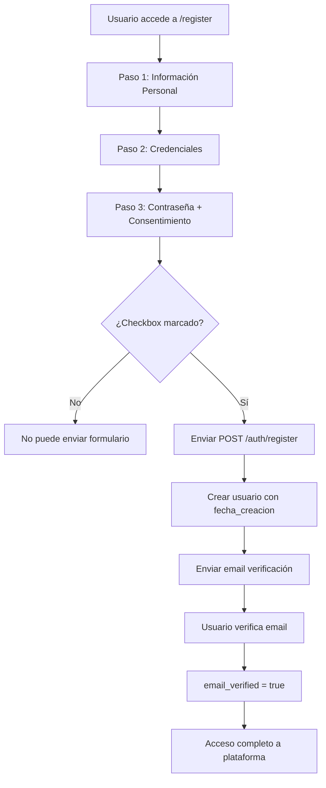

# =====================================================
# ACADIFY - CHECKLIST CUMPLIMIENTO LEGAL Y ÉTICO
# Proyecto Formativo SENA - React + FastAPI
# Fecha de Evaluación: 2025-12-16
# =====================================================

## RESUMEN EJECUTIVO

| Componente | Implementación |
|------------|----------------|
| Política de privacidad | Página TratamientoDatos.tsx |
| Términos de uso | Página Consentimiento.tsx |
| Checkbox obligatorio | Register.tsx (required) |
| Auditoría | AuditoriaAcciones table |

---

## CRITERIOS DE EVALUACIÓN

### 1. Política de privacidad y términos visibles en el registro
| Criterio | Cumple | Justificación |
|----------|--------|---------------|
| Política de privacidad | ✅ SÍ | /legal/TratamientoDatos |
| Términos visibles | ✅ SÍ | Enlaces accesibles desde registro |
| Checkbox obligatorio | ✅ SÍ | required en input checkbox |

**Página de Tratamiento de Datos (TratamientoDatos.tsx):**
```tsx
<h1>Política de Tratamiento de Datos</h1>
<div className="prose">
  <h2>1. Finalidad del tratamiento</h2>
  <p>Los datos personales se utilizan exclusivamente para la gestión de la 
     plataforma, la personalización de la experiencia educativa...</p>
  
  <h2>2. Datos recolectados</h2>
  <ul>
    <li>Nombre, apellidos y datos de contacto</li>
    <li>Información académica y de uso</li>
    <li>Dirección IP y datos técnicos de acceso</li>
  </ul>
  
  <h2>3. Derechos del usuario</h2>
  <p>Puedes acceder, actualizar, rectificar o eliminar tus datos...</p>
  
  <h2>4. Seguridad</h2>
  <p>Implementamos medidas técnicas y organizativas para proteger tus datos...</p>
  
  <h2>5. Consentimiento</h2>
  <p>Al registrarte y usar Acadify, aceptas esta política de tratamiento...</p>
  
  <h2>6. Cambios en la política</h2>
  <p>Acadify puede actualizar esta política. Notificaremos los cambios...</p>
</div>
```

**Página de Consentimiento Informado (Consentimiento.tsx):**
```tsx
<h1>Consentimiento Informado</h1>
<div className="prose">
  <p>Al registrarte y utilizar Acadify, otorgas tu consentimiento para el 
     tratamiento de tus datos personales...</p>
  
  <h2>¿Qué implica tu consentimiento?</h2>
  <ul>
    <li>Permites que Acadify procese tus datos para fines educativos</li>
    <li>Autorizas el envío de notificaciones relevantes</li>
    <li>Reconoces tu derecho a revocar este consentimiento</li>
  </ul>
  
  <h2>¿Cómo puedes revocar tu consentimiento?</h2>
  <p>Puedes solicitar la revocatoria escribiendo a contacto@acadify.org</p>
</div>
```

**Archivos:**
- `frontend/src/pages/legal/TratamientoDatos.tsx`
- `frontend/src/pages/legal/Consentimiento.tsx`

---

### 2. Consentimiento informado para tratamiento de datos personales
| Criterio | Cumple | Justificación |
|----------|--------|---------------|
| Checkbox en registro | ✅ SÍ | Step 3 del formulario de registro |
| Checkbox obligatorio | ✅ SÍ | required HTML attribute |
| Enlaces a políticas | ✅ SÍ | target="_blank" a páginas legales |

**Checkbox en Register.tsx (líneas 722-738):**
```tsx
{/* Política de privacidad - En el Paso 3 del registro */}
<motion.div className="p-4 rounded-2xl bg-gray-50 border">
  <label className="flex items-start gap-3 text-xs cursor-pointer">
    <input
      type="checkbox"
      required  // ← OBLIGATORIO
      className="mt-1 w-4 h-4 text-emerald-600 border-gray-300 rounded focus:ring-emerald-500"
    />
    <span>
      Acepto el{' '}
      <a href="/legal/TratamientoDatos" 
         className="text-emerald-600 underline"
         target="_blank" 
         rel="noopener noreferrer">
        tratamiento de datos
      </a>{' '}
      y el{' '}
      <a href="/legal/Consentimiento"
         className="text-emerald-600 underline"
         target="_blank" 
         rel="noopener noreferrer">
        consentimiento informado
      </a>
    </span>
  </label>
</motion.div>
```

**También en Login.tsx (líneas 493-544):**
```tsx
<label className="flex items-start gap-3 text-xs cursor-pointer">
  <input
    type="checkbox"
    checked={accepted}
    onChange={() => setAccepted(!accepted)}
    required
  />
  <span>
    Acepto el{' '}
    <a href="/legal/TratamientoDatos" 
       className="text-violet-600 underline"
       target="_blank" 
       rel="noopener noreferrer">
      tratamiento de datos
    </a>
  </span>
</label>
```

**Archivo:** `frontend/src/pages/auth/Register.tsx`

---

### 3. Registro de consentimientos otorgados
| Criterio | Cumple | Justificación |
|----------|--------|---------------|
| Tabla de auditoría | ✅ SÍ | AuditoriaAcciones en PostgreSQL |
| Registro de usuario | ✅ SÍ | usuario_id, fecha, acción |
| Trazabilidad | ✅ SÍ | IP, fecha_hora, detalles |

**Tabla AuditoriaAcciones:**
```sql
CREATE TABLE "AuditoriaAcciones" (
    auditoria_id UUID PRIMARY KEY DEFAULT gen_random_uuid(),
    usuario_id UUID REFERENCES usuarios(usuario_id),
    accion VARCHAR(100) NOT NULL,
    tabla_afectada VARCHAR(100),
    registro_id UUID,
    detalles TEXT,
    ip_address VARCHAR(45),
    fecha_hora TIMESTAMP WITH TIME ZONE DEFAULT NOW()
);
```

**Registro al crear usuario (auth_service.py):**
```python
async def register_user(self, db: Session, user_data: UsuarioCreate):
    # 1. Validar política de contraseña
    self._validate_password_strength(user_data.password)
    
    # 2. Crear usuario con email_verified = False
    user_dict["email_verified"] = False
    new_user = usuario_crud.create(db=db, obj_in=user_dict)
    
    # 3. Enviar email de verificación (implica aceptación de términos)
    await self._send_verification_email(new_user)
    
    return new_user
```

**Campos de auditoría en modelo Usuario:**
```python
class Usuario(Base):
    usuario_id = Column(UUID, primary_key=True)
    fecha_creacion = Column(DateTime, default=datetime.utcnow)  # ← Registro
    fecha_actualizacion = Column(DateTime, onupdate=datetime.utcnow)
    email_verified = Column(Boolean, default=False)
    # ... otros campos
```

**Archivos:**
- `backend/database/create_auditoria_table.sql`
- `backend/src/models/users/usuario.py`

---

## FLUJO DE CONSENTIMIENTO



---

## CONCLUSIÓN

| # | Aspecto a Valorar | Cumple |
|---|-------------------|--------|
| 1 | Política de privacidad y términos visibles | ✅ SÍ |
| 2 | Consentimiento informado para tratamiento de datos | ✅ SÍ |
| 3 | Registro de consentimientos otorgados | ✅ SÍ |

**ESTADO GENERAL: ✅ TODOS LOS CRITERIOS CUMPLIDOS (3/3)**

---

## ARCHIVOS DE REFERENCIA

| Archivo | Descripción |
|---------|-------------|
| `frontend/src/pages/legal/TratamientoDatos.tsx` | Política de privacidad (6 secciones) |
| `frontend/src/pages/legal/Consentimiento.tsx` | Consentimiento informado |
| `frontend/src/pages/auth/Register.tsx` | Formulario con checkbox obligatorio |
| `frontend/src/pages/auth/Login.tsx` | Login con checkbox de aceptación |
| `backend/database/create_auditoria_table.sql` | Tabla de auditoría |
| `backend/src/models/users/usuario.py` | Modelo con fecha_creacion |

---

## CUMPLIMIENTO CON NORMATIVAS

| Normativa | Cumplimiento |
|-----------|--------------|
| **Ley 1581 de 2012** (Colombia) | ✅ Tratamiento de datos personales |
| **Ley 1273 de 2009** (Colombia) | ✅ Protección de información |
| **GDPR** (principios aplicables) | ✅ Consentimiento explícito |
| **Habeas Data** | ✅ Derecho a acceder, rectificar, eliminar |

---

*Generado automáticamente - Proyecto Acadify*
*Fecha: 2025-12-16*
