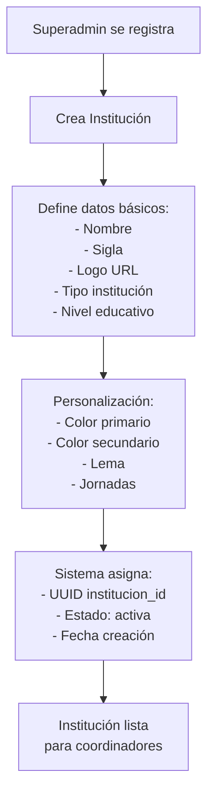
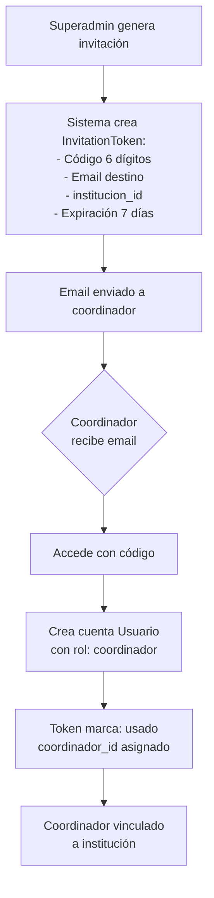
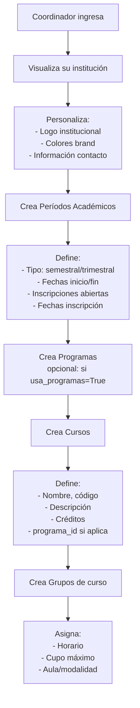
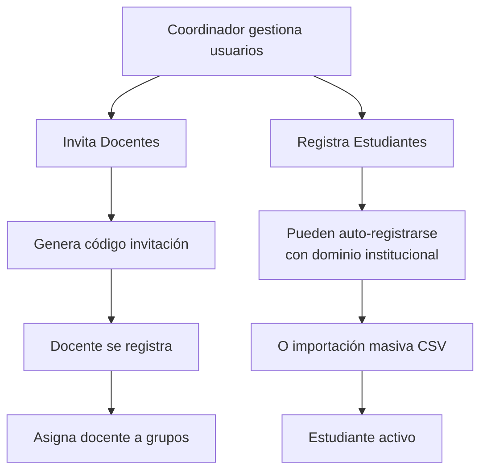
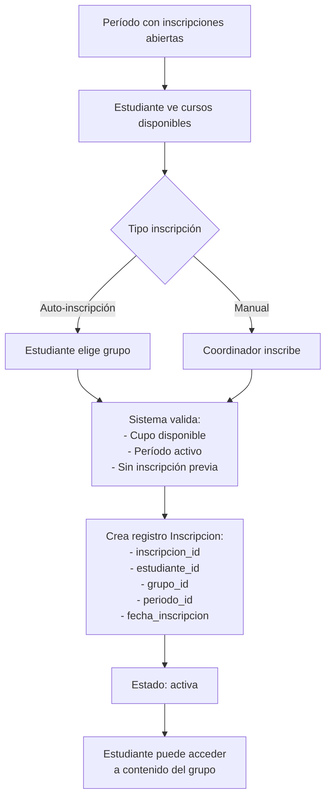
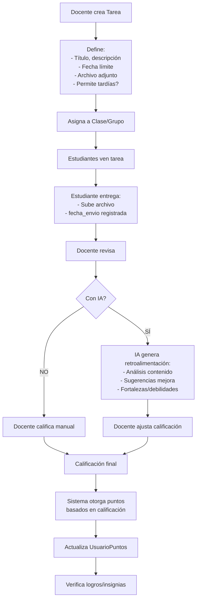
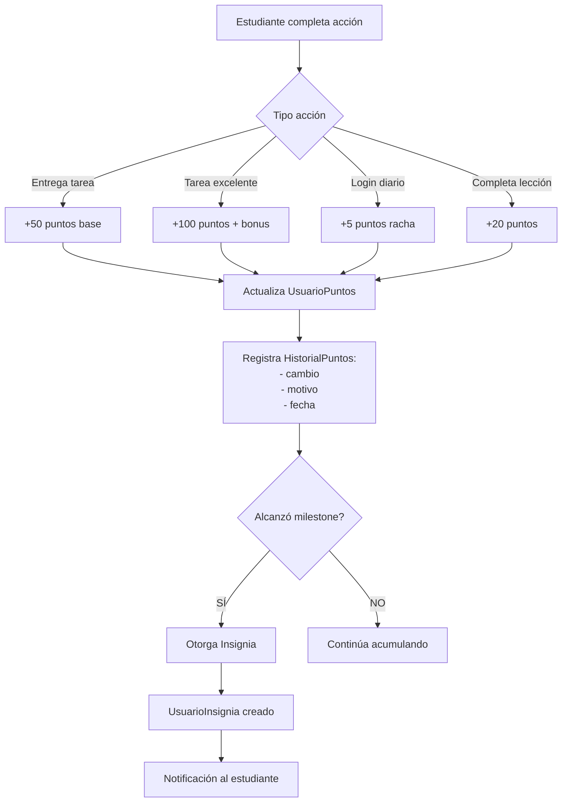

# 📊 ANÁLISIS COMPLETO DEL SISTEMA ACADIFY

**Fecha de análisis**: 31 de octubre de 2025  
**Estado del backend**: ✅ 208/208 tests passing (100%)  
**Versión**: v1.0 - Sistema de Gestión Educativa con Gamificación

---

## 🎯 **VISIÓN GENERAL**

Acadify es una plataforma educativa gamificada que permite:
- ✅ Gestión multi-institucional
- ✅ Sistema de invitaciones por código
- ✅ Personalización por institución (logo, colores)
- ✅ Cursos, grupos y períodos académicos
- ✅ Sistema de tareas con entregas
- ✅ Gamificación (puntos, insignias, rachas)
- 🔄 **PENDIENTE**: Retroalimentación con IA en tareas

---

## 🌊 **FLUJO COMPLETO DEL SISTEMA**

### **1️⃣ FASE: CREACIÓN DE INSTITUCIÓN (Superadmin)**



**✅ ESTADO ACTUAL**:
- Modelo `Institucion` completo con 50+ campos
- Validaciones de unicidad (nombre, sigla, NIT)
- Soporte multi-tenant (múltiples instituciones)
- CRUD completo implementado

---

### **2️⃣ FASE: INVITACIÓN A COORDINADOR**



**✅ ESTADO ACTUAL**:
- Tabla `invitation_tokens` con estados (pendiente, usado, expirado)
- Códigos únicos de 6 dígitos
- Validación de expiración
- Envío de emails configurado (Gmail SMTP)

---

### **3️⃣ FASE: CONFIGURACIÓN INSTITUCIONAL (Coordinador)**



**✅ ESTADO ACTUAL**:
- Sistema de **Períodos Académicos** completo:
  - ✅ 120/120 tests passing
  - ✅ Estados: programado, en_curso, evaluaciones, finalizado, cancelado
  - ✅ Validaciones de fechas
  - ✅ Marcador de "período actual"
  - ✅ Control inscripciones abiertas
  
- Sistema de **Cursos** completo:
  - ✅ CRUD completo
  - ✅ Soporte programas (opcional)
  - ✅ Metadata enriquecida
  
- Sistema de **Grupos** (clases):
  - ✅ Horarios definidos
  - ✅ Cupo máximo
  - ✅ Vinculación curso-período

---

### **4️⃣ FASE: GESTIÓN DE USUARIOS**



**✅ ESTADO ACTUAL**:
- Modelo `Usuario` base con discriminador de rol
- Herencia: `Estudiante`, `Docente`, `Coordinador`, `Administrador`
- Sistema de invitaciones para docentes
- Auto-registro validando dominio institucional
- Estados: activo, inactivo, suspendido, eliminado

---

### **5️⃣ FASE: INSCRIPCIONES**



**✅ ESTADO ACTUAL**:
- Sistema de **Inscripciones** completo:
  - ✅ 88/88 tests passing (100%)
  - ✅ Modelo completo con timestamps
  - ✅ Estados: activa, retirada, cancelada
  - ✅ Validaciones de cupo
  - ✅ Unicidad estudiante-grupo-período
  - ✅ Retiros con fecha y motivo

---

### **6️⃣ FASE: TAREAS (🎯 TU FOCO ACTUAL)**



**✅ ESTADO ACTUAL**:

**Modelos implementados**:
```python
class Tarea:
    tarea_id: UUID
    docente_id: UUID
    clase_id: UUID
    titulo: String(50)
    descripcion: TEXT
    fecha_asignacion: TIMESTAMP
    fecha_limite: TIMESTAMP
    archivo_adjunto: TEXT
    permite_entregas_tardias: BOOLEAN

class EntregarTarea:
    entrega_id: UUID
    tarea_id: UUID
    estudiante_id: UUID
    archivo: TEXT
    fecha_envio: TIMESTAMP
    calificacion: NUMERIC(3,1)  # 0.0 - 5.0
    fecha_revision: TIMESTAMP
```

**⚠️ LIMITACIONES ACTUALES**:
- ❌ No hay campo `retroalimentacion` en EntregarTarea
- ❌ No hay campo `retroalimentacion_ia` separado
- ❌ No hay enums TipoTarea, PrioridadTarea en modelo (solo en enums.py)
- ❌ No hay campo `estado` en Tarea (asignada, vencida, etc.)
- ❌ No hay campo `puntos_asignados` en Tarea
- ❌ No hay integración con sistema de puntos

**🆕 NECESARIO AGREGAR**:
```python
# En modelo Tarea:
- tipo: TipoTarea (ensayo, proyecto, ejercicios, etc.)
- prioridad: PrioridadTarea (baja, media, alta, urgente)
- estado: EstadoTarea (asignada, en_progreso, vencida, etc.)
- puntos_base: INTEGER (puntos por completar)
- puntos_bonificacion: INTEGER (puntos extra por excelencia)
- peso_calificacion: NUMERIC (% en calificación final)
- rubrica: JSONB (criterios de evaluación)
- habilitar_ia: BOOLEAN (usar retroalimentación IA)

# En modelo EntregarTarea:
- estado: EstadoEntrega (borrador, entregada, calificada, etc.)
- intentos: INTEGER (número de reenvíos)
- retroalimentacion_docente: TEXT
- retroalimentacion_ia: JSONB {
    analisis_general: str,
    fortalezas: [str],
    areas_mejora: [str],
    sugerencias: [str],
    nivel_cumplimiento: str,
    puntos_clave: [str]
  }
- puntos_otorgados: INTEGER
- comentarios_privados: TEXT (para docente)
```

---

### **7️⃣ FASE: GAMIFICACIÓN**



**✅ ESTADO ACTUAL**:
- Modelo `UsuarioPuntos`: puntos acumulados por usuario
- Modelo `HistorialPuntos`: registro de cambios con motivo
- Modelo `Insignia`: logros desbloqueables
- Modelo `UsuarioInsignia`: insignias obtenidas
- Modelo `RachaUsuario`: racha de días consecutivos
- Modelo `Recompensa`: items canjeables con puntos

**⚠️ FALTA**:
- ❌ Integración automática Tarea → Puntos
- ❌ Reglas de negocio para cálculo puntos por calificación
- ❌ Triggers o listeners para eventos

---

## 📦 **ESTRUCTURA DE BASE DE DATOS**

### **Tablas Clave Implementadas** ✅

```sql
-- ACADÉMICO
- Institucion (50+ campos, personalización completa)
- Programa (opcional, si usa_programas=true)
- Curso (con metadata enriquecida)
- PeriodoAcademico (gestión temporal completa)
- Grupo/Clase (horarios, cupo)
- Inscripcion (estudiante-grupo-período)

-- USUARIOS
- Usuario (base con discriminador)
- Estudiante, Docente, Coordinador, Administrador (herencia)
- InstitucionCoordinador (vínculo coordinador-institución)
- invitation_tokens (sistema invitaciones)

-- TAREAS
- Tarea (asignaciones)
- EntregarTarea (entregas estudiantes)

-- EVALUACIONES
- EscalaCalificacion
- ValorCalificacion

-- GAMIFICACIÓN
- UsuarioPuntos
- HistorialPuntos
- Insignia
- UsuarioInsignia
- RachaUsuario
- Recompensa
- UsuarioRecompensa

-- COMUNICACIÓN
- Mensaje (mensajería interna)
- Notificacion

-- AVATAR
- Avatar, CabezaAvatar, CamisaAvatar, PantalonAvatar
- (sistema customización avatar estudiante)
```

---

## 🧪 **ESTADO DE TESTING**

### **✅ COMPLETADO AL 100%**

```
┌──────────────────────────────────────┐
│  Total: 208/208 tests passing ✅    │
├──────────────────────────────────────┤
│  • Inscripciones:  88/88  (100%)    │
│  • Períodos:       120/120 (100%)   │
│  • Modelo:         54/54             │
│  • CRUD:           72/72             │
│  • Service:        45/45             │
│  • API:            37/37             │
└──────────────────────────────────────┘
```

### **⏭️ SKIPPED (3 tests)**
- Tests de creación de períodos (requieren tabla Institucion en test DB)
- No críticos, se pueden implementar en tests de integración

### **⚠️ WARNINGS (92)**
- SQLAlchemy deprecation warnings
- Pydantic v2 warnings
- No afectan funcionalidad

---

## 🎯 **ANÁLISIS: SISTEMA DE TAREAS CON IA**

### **Tu Objetivo**
> "Las tareas es el método más común de dar puntos. Integrar IA que haga retroalimentación. Ejemplo: tarea sobre fundamentos Python (if-else) → Profesor califica → IA genera retroalimentación profunda."

### **Propuesta de Arquitectura**

#### **1. Actualización de Modelos**

```python
# src/models/classes/tarea.py - MEJORADO
class Tarea(Base):
    # ... campos existentes ...
    
    # NUEVOS CAMPOS
    tipo = Column(ENUM(TipoTarea), nullable=False, default=TipoTarea.EJERCICIOS)
    prioridad = Column(ENUM(PrioridadTarea), default=PrioridadTarea.MEDIA)
    estado = Column(ENUM(EstadoTarea), default=EstadoTarea.ASIGNADA)
    
    # GAMIFICACIÓN
    puntos_base = Column(Integer, nullable=False, default=50)
    puntos_bonificacion = Column(Integer, default=20)
    peso_calificacion = Column(NUMERIC(5,2))  # % en nota final
    
    # IA
    habilitar_retroalimentacion_ia = Column(Boolean, default=True)
    prompt_ia_personalizado = Column(TEXT)  # Instrucciones específicas para IA
    
    # RUBRICA
    rubrica = Column(JSONB)  # Criterios evaluación estructurados
```

```python
# src/models/classes/entregar_tarea.py - MEJORADO
class EntregarTarea(Base):
    # ... campos existentes ...
    
    # NUEVOS CAMPOS
    estado = Column(ENUM(EstadoEntrega), default=EstadoEntrega.ENTREGADA)
    intentos = Column(Integer, default=1)
    es_tardia = Column(Boolean, computed="fecha_envio > tarea.fecha_limite")
    
    # RETROALIMENTACIÓN
    retroalimentacion_docente = Column(TEXT)
    retroalimentacion_ia = Column(JSONB)  # Ver estructura abajo
    
    # GAMIFICACIÓN
    puntos_otorgados = Column(Integer)
    calificacion_preliminar_ia = Column(NUMERIC(3,1))  # Sugerencia IA
```

**Estructura `retroalimentacion_ia` JSONB**:
```json
{
  "timestamp": "2025-10-31T10:30:00Z",
  "modelo_usado": "gemini-1.5-flash",
  "analisis_general": "El estudiante demuestra comprensión básica de condicionales...",
  "fortalezas": [
    "Correcta sintaxis de if-else",
    "Buenos nombres de variables",
    "Código legible"
  ],
  "areas_mejora": [
    "Falta validación de entrada",
    "No maneja casos extremos",
    "Podría usar elif para optimizar"
  ],
  "sugerencias_especificas": [
    {
      "linea": 5,
      "codigo_actual": "if x > 0:",
      "sugerencia": "Validar que x sea numérico antes de comparar",
      "ejemplo": "if isinstance(x, (int, float)) and x > 0:"
    }
  ],
  "nivel_cumplimiento": "80%",
  "calificacion_sugerida": 4.0,
  "puntos_clave_missing": [
    "Documentación",
    "Tests unitarios"
  ],
  "recursos_recomendados": [
    "https://docs.python.org/es/3/tutorial/controlflow.html"
  ]
}
```

---

#### **2. Integración con IA - OPCIÓN GRATUITA**

**Recomendación: Google Gemini 1.5 Flash (FREE Tier)**

**¿Por qué Gemini?**
- ✅ **GRATUITO**: 15 requests/minuto, 1 millón tokens/mes
- ✅ Soporte español nativo
- ✅ Análisis de código (Python, Java, etc.)
- ✅ Análisis de archivos (PDF, DOCX, imágenes)
- ✅ Salida JSON estructurada
- ✅ API simple de integrar

**Alternativas**:
- OpenAI GPT-4o-mini: $0.15/1M tokens (muy barato)
- Claude Haiku: $0.25/1M tokens
- Llama 3.1 (self-hosted, 100% gratis pero requiere GPU)

**Implementación con Gemini**:

```python
# src/services/ai/gemini_service.py
import google.generativeai as genai
from typing import Dict, Any
import json

class GeminiService:
    def __init__(self, api_key: str):
        genai.configure(api_key=api_key)
        self.model = genai.GenerativeModel('gemini-1.5-flash')
    
    async def analizar_tarea(
        self,
        titulo_tarea: str,
        descripcion_tarea: str,
        archivo_entrega: str,  # Base64 o URL
        rubrica: Dict = None,
        tipo_tarea: str = "ejercicios"
    ) -> Dict[str, Any]:
        """
        Genera retroalimentación inteligente de una tarea
        """
        
        prompt = self._construir_prompt(
            titulo_tarea, 
            descripcion_tarea, 
            rubrica, 
            tipo_tarea
        )
        
        # Enviar archivo + prompt
        response = await self.model.generate_content([
            prompt,
            {"mime_type": "text/plain", "data": archivo_entrega}
        ])
        
        # Parsear respuesta JSON
        retroalimentacion = json.loads(response.text)
        
        return retroalimentacion
    
    def _construir_prompt(self, titulo, descripcion, rubrica, tipo):
        return f"""
        Eres un asistente pedagógico experto. Analiza la siguiente entrega de tarea:
        
        **Tarea**: {titulo}
        **Descripción**: {descripcion}
        **Tipo**: {tipo}
        
        **Rúbrica de evaluación**:
        {json.dumps(rubrica, indent=2)}
        
        **INSTRUCCIONES**:
        1. Analiza el contenido del archivo adjunto
        2. Identifica fortalezas específicas
        3. Señala áreas de mejora con ejemplos concretos
        4. Sugiere calificación (0.0-5.0) basada en rúbrica
        5. Proporciona recursos para mejorar
        
        **RESPONDE EN JSON** con esta estructura:
        {{
            "analisis_general": "...",
            "fortalezas": ["..."],
            "areas_mejora": ["..."],
            "sugerencias_especificas": [...],
            "nivel_cumplimiento": "X%",
            "calificacion_sugerida": X.X,
            "puntos_clave_missing": ["..."],
            "recursos_recomendados": ["..."]
        }}
        
        Sé constructivo, específico y educativo.
        """
```

**Configuración en .env**:
```properties
# AI Configuration
GEMINI_API_KEY=your-gemini-api-key-here
AI_ENABLED=true
AI_PROVIDER=gemini  # gemini | openai | claude
AI_MAX_RETRIES=3
```

---

#### **3. Flujo Completo con IA**

```python
# src/services/academic/tarea_service.py
from .ai.gemini_service import GeminiService
from ..gamification.puntos_service import PuntosService

class TareaService:
    
    async def calificar_entrega_con_ia(
        self,
        entrega_id: UUID,
        calificacion_docente: float,
        db: Session,
        usuario_docente: Usuario
    ) -> EntregarTarea:
        """
        Califica entrega y genera retroalimentación IA
        """
        
        # 1. Obtener entrega y tarea
        entrega = db.query(EntregarTarea).get(entrega_id)
        tarea = entrega.tarea
        
        # 2. ¿Tiene IA habilitada?
        if tarea.habilitar_retroalimentacion_ia:
            # Generar retroalimentación IA
            retroalimentacion_ia = await self.gemini_service.analizar_tarea(
                titulo_tarea=tarea.titulo,
                descripcion_tarea=tarea.descripcion,
                archivo_entrega=entrega.archivo,
                rubrica=tarea.rubrica,
                tipo_tarea=tarea.tipo
            )
            
            entrega.retroalimentacion_ia = retroalimentacion_ia
            entrega.calificacion_preliminar_ia = retroalimentacion_ia['calificacion_sugerida']
        
        # 3. Aplicar calificación docente
        entrega.calificacion = calificacion_docente
        entrega.fecha_revision = datetime.utcnow()
        entrega.estado = EstadoEntrega.CALIFICADA
        
        # 4. Calcular puntos
        puntos = self._calcular_puntos(tarea, calificacion_docente, entrega.es_tardia)
        entrega.puntos_otorgados = puntos
        
        # 5. Otorgar puntos al estudiante
        await self.puntos_service.agregar_puntos(
            usuario_id=entrega.estudiante_id,
            puntos=puntos,
            motivo=f"Tarea calificada: {tarea.titulo} ({calificacion_docente}/5.0)",
            db=db
        )
        
        # 6. Verificar insignias
        await self.insignias_service.verificar_logros(entrega.estudiante_id, db)
        
        db.commit()
        return entrega
    
    def _calcular_puntos(self, tarea: Tarea, calificacion: float, es_tardia: bool) -> int:
        """
        Fórmula de puntos:
        - Base: tarea.puntos_base
        - Multiplicador por calificación: (calificacion / 5.0)
        - Bonus si calificación >= 4.5: puntos_bonificacion
        - Penalización si tardía: -30%
        """
        puntos = tarea.puntos_base * (calificacion / 5.0)
        
        if calificacion >= 4.5:
            puntos += tarea.puntos_bonificacion
        
        if es_tardia:
            puntos *= 0.7  # 30% menos
        
        return int(puntos)
```

---

## 🔧 **PROBLEMAS A CORREGIR**

### **1. Test Flaky en Períodos** ✅ CORREGIDO
- ❌ Problema: `test_obtener_multiples_periodos` fallaba intermitentemente
- ✅ Solución: Agregado `db_session.flush()` y asserts mejorados

### **2. Scripts de Creación de Datos**
Verificar que los scripts funcionen:

```bash
# Ejecutar script de datos completos
python scripts/create_complete_test_data.py

# Verificar estructura
python scripts/quick_check.py
```

### **3. Migraciones Pendientes**
¿Necesitas ejecutar migraciones para tareas mejoradas?

```bash
# Generar migración para campos nuevos en Tarea y EntregarTarea
alembic revision --autogenerate -m "add_ai_feedback_and_gamification_to_tareas"

# Aplicar
alembic upgrade head
```

---

## 📝 **PRÓXIMOS PASOS RECOMENDADOS**

### **Prioridad 1: Sistema de Tareas con IA** 🎯
1. ✅ Actualizar modelos `Tarea` y `EntregarTarea`
2. ✅ Crear migración Alembic
3. ✅ Implementar `GeminiService`
4. ✅ Integrar con `TareaService`
5. ✅ Crear endpoints API para calificación con IA
6. ✅ Tests unitarios (50+ tests)
7. ✅ Tests de integración con mock de IA

### **Prioridad 2: Integración Gamificación** 🎮
1. Service `PuntosService` con reglas de negocio
2. Listeners/Signals para eventos automáticos
3. Dashboard de gamificación (puntos, ranking, insignias)

### **Prioridad 3: Frontend** 🎨
1. Vista de tareas (crear, listar, entregar)
2. Vista de calificación con retroalimentación IA
3. Dashboard de gamificación

---

## 🤖 **COSTOS ESTIMADOS IA**

### **Gemini 1.5 Flash (RECOMENDADO)** FREE
- ✅ 15 requests/minuto
- ✅ 1 millón tokens/mes
- ✅ Input: 128K tokens por request
- ✅ Suficiente para 1000-5000 tareas/mes GRATIS

### **Escalamiento Futuro**
Si superas el free tier:
- **Gemini 1.5 Flash**: $0.075/1M tokens (muy barato)
- **OpenAI GPT-4o-mini**: $0.15/1M tokens
- **Self-hosted Llama 3.1**: Gratis pero requiere GPU

**Estimación**: 
- 1000 tareas/mes con IA = $1-2 USD/mes
- Completamente viable para producción

---

## ✅ **LO QUE FUNCIONA PERFECTO**

1. ✅ Creación instituciones
2. ✅ Sistema invitaciones coordinadores
3. ✅ Personalización institucional
4. ✅ Períodos académicos (100% testeado)
5. ✅ Inscripciones (100% testeado)
6. ✅ Estructura base tareas
7. ✅ Sistema gamificación (modelos)

## 🔄 **LO QUE NECESITA DESARROLLO**

1. 🔄 Campos adicionales en Tarea/EntregarTarea
2. 🔄 Integración IA (GeminiService)
3. 🔄 Lógica gamificación automática
4. 🔄 Vistas frontend para tareas
5. 🔄 Dashboard gamificación

---

## 📞 **PREGUNTAS PARA TI**

1. **¿Confirmamos usar Gemini 1.5 Flash (gratis)?**
2. **¿Qué otros tipos de tareas quieres soportar?** (ya tienes: ensayo, proyecto, ejercicios, investigación, presentación, laboratorio, lectura, examen)
3. **¿Quieres que la IA califique automáticamente o solo sugiera?** (recomiendo: IA sugiere, docente aprueba)
4. **¿Qué formato de archivos deben soportar las tareas?** (PDF, DOCX, código Python, imágenes?)
5. **¿Cuántos puntos base por tarea?** (mi sugerencia: 50 base, 20 bonus, -30% si tardía)

---

**Generado por**: Análisis automático del repositorio Acadify  
**Última actualización**: 31 de octubre de 2025
