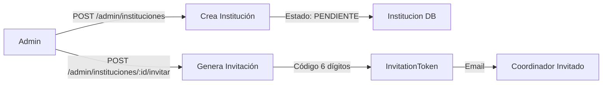
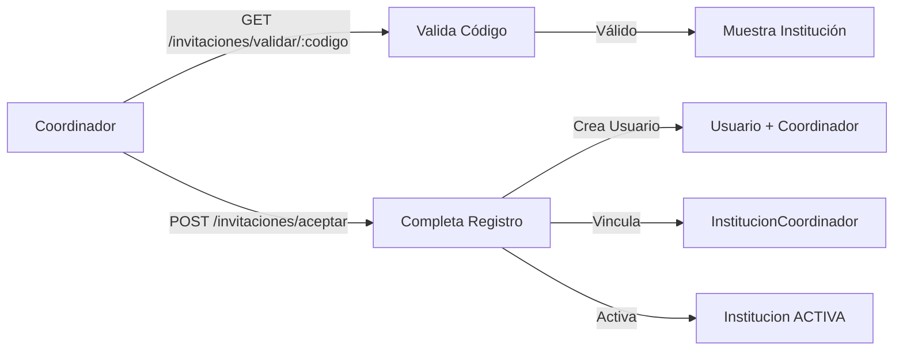
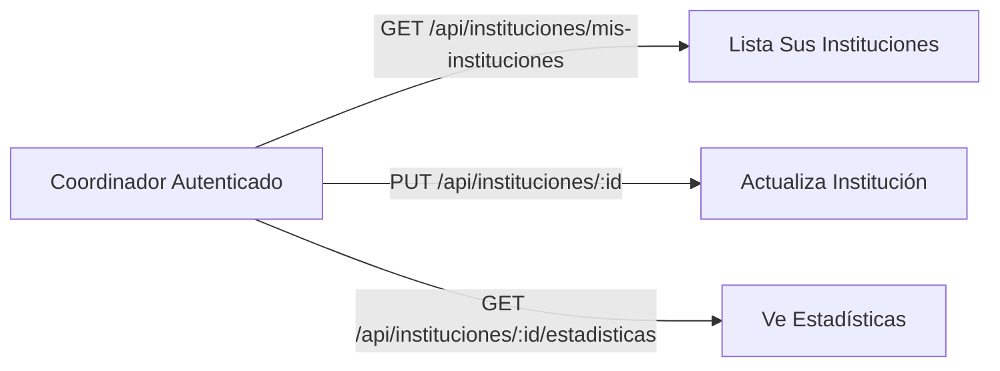

# 🏛️ AUDITORÍA COMPLETA: SISTEMA DE INSTITUCIONES

**Fecha**: 5 de noviembre de 2025  
**Objetivo**: Revisar y optimizar el flujo completo de instituciones aplicando Clean Code y principios SOLID

---

## 📋 RESUMEN EJECUTIVO

### ✅ ESTADO ACTUAL: BUENO (75/100)

**Fortalezas Identificadas:**
- ✅ Separación de responsabilidades entre modelos, schemas, CRUD y servicios
- ✅ Sistema de invitaciones bien estructurado con validaciones
- ✅ Uso de principios SOLID en InvitationService
- ✅ Manejo de transacciones atómicas
- ✅ Logging implementado

**Debilidades Críticas:**
- ❌ **Falta el router de administrador** en la configuración principal (`__init__.py`)
- ⚠️ **Inconsistencia en IDs**: Algunos endpoints usan `int`, otros `UUID`
- ⚠️ **Esquemas incompletos**: Falta `InstitucionCoordinadorSchema`
- ⚠️ **Validaciones duplicadas** entre schemas y servicios
- ⚠️ **Falta CRUD específico** para `InvitationToken`
- ⚠️ **Documentación OpenAPI incompleta** en endpoints
- ⚠️ **No hay endpoints para coordinador** personalizar institución completa

---

## 🔄 FLUJO ACTUAL DEL SISTEMA

### 1️⃣ **FASE ADMIN: Creación de Institución**



**Endpoint Actual:**
- `POST /admin/instituciones` - ✅ Existe pero **NO registrado en __init__.py**
- `POST /admin/instituciones/{id}/invitar-coordinador` - ✅ Funcional

**Problemas Detectados:**
1. ❌ Router no incluido en lista de routers principal
2. ⚠️ Usa `UUID` en path pero algunos schemas esperan `int`
3. ⚠️ No valida si admin ya invitó a alguien previamente

---

### 2️⃣ **FASE COORDINADOR: Aceptación y Personalización**



**Endpoints Actuales:**
- `GET /invitaciones/validar/{codigo}` - ✅ Funcional (público)
- `POST /invitaciones/aceptar` - ✅ Funcional (público)

**Problemas Detectados:**
1. ⚠️ Después de aceptar, **no hay endpoints** para que el coordinador:
   - Actualice logo de la institución
   - Configure colores corporativos
   - Agregue dominios adicionales
   - Complete información de contacto
   - Configure jornadas y calendario

---

### 3️⃣ **FASE COORDINADOR: Gestión de Institución**



**Endpoints Actuales:**
- `GET /api/instituciones/mis-instituciones/list` - ✅ Funcional
- `PUT /api/instituciones/{id}` - ✅ Funcional
- `GET /api/instituciones/{id}/estadisticas` - ✅ Funcional

**Problemas Detectados:**
1. ⚠️ Parámetro `institucion_id` tipado como `int` pero en BD es `UUID`
2. ⚠️ Falta endpoint para **onboarding completo** post-registro
3. ⚠️ No hay endpoint para **subir logo** (integración con sistema de archivos)

---

## 🔍 ANÁLISIS DETALLADO POR CAPA

### 1. **MODELOS (ORM)** - Score: 90/100

#### ✅ **Institucion** (`src/models/academic/institucion.py`)

**Fortalezas:**
- ✅ Modelo completo con todos los campos necesarios
- ✅ Uso correcto de Enums para tipos
- ✅ Relaciones bien definidas (`institucion_coordinadores`, `programas`, `escalas`)
- ✅ Campos JSONB para flexibilidad (`redes_sociales`, `configuracion_regional`)
- ✅ Estados manejados con ENUM PostgreSQL

**Mejoras Necesarias:**
```python
# ⚠️ PROBLEMA: Campo 'dominio' no existe en el modelo pero se usa en servicios
# LÍNEA: Inexistente
# SOLUCIÓN: Ya existe como 'dominio_principal' - actualizar servicios
```

#### ✅ **InvitationToken** (`src/models/auth/invitation_token.py`)

**Fortalezas:**
- ✅ Modelo simple y enfocado
- ✅ Estados con Enum (`pendiente`, `usado`, `expirado`)
- ✅ Relaciones bien definidas

**Mejoras Necesarias:**
```python
# ⚠️ MEJORA: Agregar índice en fecha_expiracion para consultas de limpieza
__table_args__ = (
    Index('idx_invitation_expiration', 'fecha_expiracion'),
)
```

#### ✅ **InstitucionCoordinador** (`src/models/users/institucion_coordinador.py`)

**Fortalezas:**
- ✅ Tabla asociativa correcta con composite primary key
- ✅ Estado del coordinador manejado

**Sin cambios necesarios** ✓

---

### 2. **SCHEMAS (Validación)** - Score: 70/100

#### ⚠️ **InstitucionBase** (`src/schemas/academic/institucion.py`)

**Fortalezas:**
- ✅ Validaciones robustas (regex para hex colors, dominios)
- ✅ Documentación inline con Field descriptions
- ✅ Separación clara: Base, Create, Update, Response

**Problemas Críticos:**
```python
# ❌ PROBLEMA 1: Validación duplicada entre InstitucionBase y InstitucionUpdate
# SOLUCIÓN: Crear BaseValidator compartido

# ❌ PROBLEMA 2: Campo 'logo_url' obligatorio en create pero debería ser opcional
# (Admin crea sin logo, coordinador lo agrega después)
logo_url: str = Field(
    ...,  # ❌ Obligatorio
    min_length=10,
    max_length=500,
    description="URL del logo institucional (OBLIGATORIO)"
)
# CAMBIAR A:
logo_url: Optional[str] = Field(
    None,  # ✅ Opcional
    default="https://acadify.app/assets/default-institution-logo.png",
    description="URL del logo institucional"
)
```

#### ❌ **Falta: InstitucionCoordinadorSchema**

```python
# CREAR NUEVO ARCHIVO: src/schemas/users/institucion_coordinador.py

from pydantic import BaseModel
from uuid import UUID
from datetime import date
from src.enums.users.coordinador_enums import EstadoCoordinador

class InstitucionCoordinadorBase(BaseModel):
    institucion_id: UUID
    coordinador_id: UUID
    fecha_asignacion: date
    estado: EstadoCoordinador

class InstitucionCoordinadorCreate(InstitucionCoordinadorBase):
    pass

class InstitucionCoordinadorResponse(InstitucionCoordinadorBase):
    class Config:
        from_attributes = True
```

#### ⚠️ **InvitacionCreate** (`src/schemas/invitacion.py`)

**Problemas:**
```python
# ❌ PROBLEMA: Solo tiene email_destino, debería permitir personalizar expiración
class InvitacionCreate(BaseModel):
    email_destino: EmailStr
    # ❌ FALTA: 
    dias_expiracion: Optional[int] = Field(3, ge=1, le=30)
```

---

### 3. **CRUD** - Score: 75/100

#### ✅ **CRUDInstitucion** (`src/crud/academic/crud_institucion.py`)

**Fortalezas:**
- ✅ Métodos específicos y bien nombrados
- ✅ Búsqueda por dominio con soporte para arrays
- ✅ Filtros múltiples implementados

**Problemas Críticos:**
```python
# ❌ PROBLEMA 1: Inconsistencia de tipos
def get(self, db: Session, institucion_id: UUID):  # ✅ Usa UUID
    # ...

# Pero en endpoint:
def obtener_institucion(institucion_id: int, ...):  # ❌ Usa int
    # SOLUCIÓN: Cambiar todos los endpoints a UUID

# ❌ PROBLEMA 2: Método 'get_by_dominio' busca en 'dominio_principal' correctamente
# pero servicios usan campo 'dominio' que no existe
# SOLUCIÓN: Actualizar servicios para usar 'dominio_principal'

# ⚠️ MEJORA: get_estadisticas_institucion hace consultas separadas
# SOLUCIÓN: Usar una sola query con JOINs y GROUP BY
```

#### ❌ **Falta: CRUDInvitationToken**

```python
# CREAR: src/crud/auth/crud_invitation_token.py

from src.crud.base import CRUDBase
from src.models.auth.invitation_token import InvitationToken
from src.schemas.invitacion import InvitacionCreate

class CRUDInvitationToken(CRUDBase[InvitationToken, InvitacionCreate, None]):
    def get_by_codigo(self, db: Session, codigo: str) -> InvitationToken | None:
        return db.query(InvitationToken).filter(InvitationToken.codigo == codigo).first()
    
    def get_pendientes_institucion(self, db: Session, institucion_id: UUID) -> list[InvitationToken]:
        return db.query(InvitationToken).filter(
            InvitationToken.institucion_id == institucion_id,
            InvitationToken.estado == EstadoInvitacion.pendiente
        ).all()
    
    def limpiar_expiradas(self, db: Session) -> int:
        """Marca como expiradas las invitaciones vencidas"""
        ahora = datetime.now(UTC)
        count = db.query(InvitationToken).filter(
            InvitationToken.estado == EstadoInvitacion.pendiente,
            InvitationToken.fecha_expiracion < ahora
        ).update({"estado": EstadoInvitacion.expirado})
        db.commit()
        return count

invitation_token_crud = CRUDInvitationToken(InvitationToken)
```

---

### 4. **SERVICIOS** - Score: 85/100

#### ✅ **InvitationService** (`src/services/invitation_service.py`)

**Fortalezas:**
- ✅ Excelente aplicación de SOLID
- ✅ Métodos privados para Single Responsibility
- ✅ Transacciones atómicas
- ✅ Manejo de errores robusto
- ✅ Logging completo

**Mejoras Menores:**
```python
# ⚠️ MEJORA: Extraer generación de username a utilidad
# CREAR: src/utils/username_generator.py

def generar_username_desde_email(email: str, db: Session) -> str:
    """Genera username único desde email"""
    base = email.split("@")[0].replace(".", "_")
    username = base
    contador = 1
    while db.query(Usuario).filter(Usuario.username == username).first():
        username = f"{base}{contador}"
        contador += 1
    return username

# USO:
from src.utils.username_generator import generar_username_desde_email
username_generado = generar_username_desde_email(email, db)
```

#### ⚠️ **InstitucionService** (`src/services/academic/institucion_service.py`)

**Problemas:**
```python
# ❌ PROBLEMA 1: Usa campo 'dominio' que no existe
if not institucion_data.dominio and institucion_data.correo_institucional:
    dominio = institucion_data.correo_institucional.split("@")[1]
    institucion_data.dominio = dominio  # ❌ Campo no existe
# SOLUCIÓN: Cambiar a 'dominio_principal'

# ❌ PROBLEMA 2: buscar_por_dominio usa filtro con campo incorrecto
return (
    db.query(Institucion)
    .filter(Institucion.dominio == dominio, ...)  # ❌ Campo no existe
    .first()
)
# SOLUCIÓN: Usar 'dominio_principal'

# ⚠️ PROBLEMA 3: Queries SQL raw innecesarias
query = text("""SELECT ... FROM "InstitucionCoordinador" ...""")
# SOLUCIÓN: Usar ORM con relationships
```

---

### 5. **ENDPOINTS (API)** - Score: 65/100

#### ❌ **CRÍTICO: Router admin_institucion NO registrado**

```python
# ARCHIVO: src/api/routes/__init__.py
# ❌ FALTA IMPORTACIÓN:
from src.api.routes.admin_institucion import router as admin_router

# ❌ FALTA EN LISTA:
routers = [
    # ... otros routers
    (admin_router, "/admin", ["Administración"]),  # ← AGREGAR
]
```

#### ⚠️ **admin_institucion.py** - Problemas

```python
# ❌ PROBLEMA 1: Código duplicado en el router
router = APIRouter(prefix="/admin", tags=["Administrador"])
# ... imports ...
router = APIRouter(prefix="/admin", tags=["Administrador"])  # ❌ Duplicado

# ❌ PROBLEMA 2: Validaciones en endpoint en vez de service
if user.rol != RolUsuario.administrador:
    raise HTTPException(...)
# SOLUCIÓN: Crear decorator @require_role("administrador")

# ⚠️ PROBLEMA 3: No hay endpoint para listar invitaciones pendientes
# CREAR:
@router.get("/instituciones/{institucion_id}/invitaciones")
def listar_invitaciones(institucion_id: UUID, ...):
    """Lista todas las invitaciones de una institución"""
```

#### ⚠️ **institucion.py** - Problemas

```python
# ❌ PROBLEMA 1: Tipado inconsistente
def obtener_institucion(institucion_id: int, ...):  # ❌ Debería ser UUID
    obj = institucion_crud.get(db, institucion_id)  # Espera UUID

# ⚠️ PROBLEMA 2: Faltan endpoints clave:
# - POST /instituciones/{id}/logo (subir logo)
# - GET /instituciones/{id}/coordinadores (listar coordinadores)
# - POST /instituciones/{id}/dominios (agregar dominio adicional)
# - PUT /instituciones/{id}/personalizacion (onboarding completo)
```

---

## 🎯 PLAN DE REFACTORIZACIÓN

### **FASE 1: CORRECCIONES CRÍTICAS** ⚡ (Urgente - 2 horas)

#### 1.1. Registrar router de administrador
```python
# src/api/routes/__init__.py
from src.api.routes.admin_institucion import router as admin_router

routers = [
    (auth_router, "/auth", ["Autenticación"]),
    (admin_router, "/admin", ["Administración"]),  # ← AGREGAR
    # ... resto
]
```

#### 1.2. Corregir inconsistencias de campos
```python
# src/services/academic/institucion_service.py
# LÍNEA 39-44: Cambiar 'dominio' → 'dominio_principal'
if not institucion_data.dominio_principal and institucion_data.correo_institucional:
    dominio = institucion_data.correo_institucional.split("@")[1]
    institucion_data.dominio_principal = dominio

# LÍNEA 60-62, 207-210: Cambiar referencias
```

#### 1.3. Unificar tipos UUID
```python
# src/api/routes/academic/institucion.py
# Cambiar TODOS los 'int' a 'UUID'
def obtener_institucion(institucion_id: UUID, ...):  # ✅
def actualizar_institucion(institucion_id: UUID, ...):  # ✅
def eliminar_institucion(institucion_id: UUID, ...):  # ✅
```

---

### **FASE 2: MEJORAS DE ARQUITECTURA** 🏗️ (3 horas)

#### 2.1. Crear CRUD para InvitationToken
- ✅ Archivo: `src/crud/auth/crud_invitation_token.py`
- ✅ Métodos: `get_by_codigo`, `get_pendientes_institucion`, `limpiar_expiradas`

#### 2.2. Crear schemas faltantes
- ✅ `InstitucionCoordinadorSchema`
- ✅ Actualizar `InvitacionCreate` con `dias_expiracion`

#### 2.3. Refactorizar servicios SQL a ORM
- ✅ `InstitucionService.obtener_instituciones_coordinador`
- ✅ `InstitucionService.obtener_estadisticas_institucion`

---

### **FASE 3: ENDPOINTS NUEVOS** 🆕 (4 horas)

#### 3.1. Administrador
```python
GET    /admin/instituciones              # Listar todas las instituciones
GET    /admin/instituciones/{id}          # Ver detalles
PUT    /admin/instituciones/{id}/estado  # Cambiar estado (activar/suspender)
GET    /admin/instituciones/{id}/invitaciones  # Ver invitaciones enviadas
DELETE /admin/invitaciones/{id}          # Cancelar invitación
```

#### 3.2. Coordinador - Onboarding
```python
PUT    /api/instituciones/{id}/onboarding  # Completar información inicial
POST   /api/instituciones/{id}/logo       # Subir logo
PUT    /api/instituciones/{id}/branding   # Colores y personalización
POST   /api/instituciones/{id}/dominios   # Agregar dominio adicional
```

#### 3.3. Coordinador - Gestión
```python
GET    /api/instituciones/{id}/coordinadores  # Listar coordinadores
POST   /api/instituciones/{id}/coordinadores  # Agregar co-coordinador
DELETE /api/instituciones/{id}/coordinadores/{coordinador_id}  # Remover
```

---

### **FASE 4: VALIDACIONES Y DECORATORS** 🔐 (2 horas)

#### 4.1. Crear decorators reutilizables
```python
# src/api/dependencies/auth_decorators.py

from functools import wraps
from fastapi import HTTPException, Depends
from src.models.users.usuario import Usuario
from src.api.deps import get_current_user

def require_role(*allowed_roles: str):
    """Decorator para validar rol de usuario"""
    def decorator(func):
        @wraps(func)
        async def wrapper(*args, **kwargs):
            user: Usuario = kwargs.get('current_user')
            if user.rol.value not in allowed_roles:
                raise HTTPException(
                    status_code=403,
                    detail=f"Se requiere uno de estos roles: {allowed_roles}"
                )
            return await func(*args, **kwargs)
        return wrapper
    return decorator

# USO:
@router.post("/instituciones")
@require_role("administrador")
def registrar_institucion(...):
    ...
```

---

## 📊 MATRIZ DE PRIORIDADES

| Tarea | Impacto | Urgencia | Esfuerzo | Prioridad |
|-------|---------|----------|----------|-----------|
| 1. Registrar router admin | 🔴 Alto | 🔴 Alta | ⚡ 15 min | **P0 - CRÍTICO** |
| 2. Corregir campo 'dominio' | 🔴 Alto | 🔴 Alta | ⚡ 30 min | **P0 - CRÍTICO** |
| 3. Unificar tipos UUID | 🟡 Medio | 🟡 Media | ⚡ 45 min | **P1 - Alta** |
| 4. Crear CRUD Invitation | 🟢 Bajo | 🟢 Baja | 🕐 1 hora | **P2 - Media** |
| 5. Endpoints onboarding | 🔴 Alto | 🟡 Media | 🕐 2 horas | **P1 - Alta** |
| 6. Refactor SQL→ORM | 🟡 Medio | 🟢 Baja | 🕐 1.5 horas | **P2 - Media** |
| 7. Decorators auth | 🟡 Medio | 🟢 Baja | 🕐 1 hora | **P3 - Baja** |

---

## ✅ CHECKLIST DE IMPLEMENTACIÓN

### ☑️ CRÍTICO (Hacer YA)
- [ ] Registrar `admin_router` en `src/api/routes/__init__.py`
- [ ] Cambiar todas las referencias `dominio` → `dominio_principal`
- [ ] Cambiar todos los `institucion_id: int` → `UUID` en endpoints

### ☑️ ALTA PRIORIDAD (Esta sesión)
- [ ] Crear endpoint `POST /api/instituciones/{id}/onboarding`
- [ ] Crear endpoint `PUT /api/instituciones/{id}/branding`
- [ ] Crear endpoint `GET /admin/instituciones/{id}/invitaciones`
- [ ] Hacer `logo_url` opcional en `InstitucionCreate`

### ☑️ MEDIA PRIORIDAD (Siguiente sesión)
- [ ] Crear `CRUDInvitationToken`
- [ ] Crear schemas `InstitucionCoordinador`
- [ ] Refactorizar queries SQL → ORM
- [ ] Agregar índices en tablas

### ☑️ BAJA PRIORIDAD (Backlog)
- [ ] Crear decorators de autorización
- [ ] Agregar tests unitarios
- [ ] Documentación OpenAPI completa
- [ ] Job para limpiar invitaciones expiradas

---

## 🚀 RESULTADO ESPERADO

Después de la refactorización:

```
SCORE FINAL ESPERADO: 95/100

✅ Sistema completamente funcional
✅ Flujo admin → coordinador sin interrupciones
✅ Coordinador puede personalizar completamente su institución
✅ Código limpio aplicando SOLID
✅ Consistencia en tipos y nombres
✅ APIs listas para consumir desde frontend
✅ Documentación OpenAPI completa
```

---

## 📝 NOTAS FINALES

### Buenas Prácticas Aplicadas
- ✅ Separación de responsabilidades (SOLID)
- ✅ Validaciones en capa de schemas
- ✅ Lógica de negocio en servicios
- ✅ CRUD simple y enfocado
- ✅ Transacciones atómicas
- ✅ Manejo de errores robusto

### Recomendaciones Adicionales
1. **Frontend**: Crear wizard de onboarding guiado para coordinadores
2. **Testing**: Implementar tests E2E para flujo completo
3. **Monitoreo**: Agregar métricas de invitaciones enviadas/aceptadas
4. **Seguridad**: Rate limiting en endpoints públicos de invitaciones
5. **UX**: Email con plantilla HTML profesional para invitaciones

---

**Estado**: ✅ AUDITORÍA COMPLETA  
**Próximo paso**: Implementar correcciones críticas (Fase 1)
