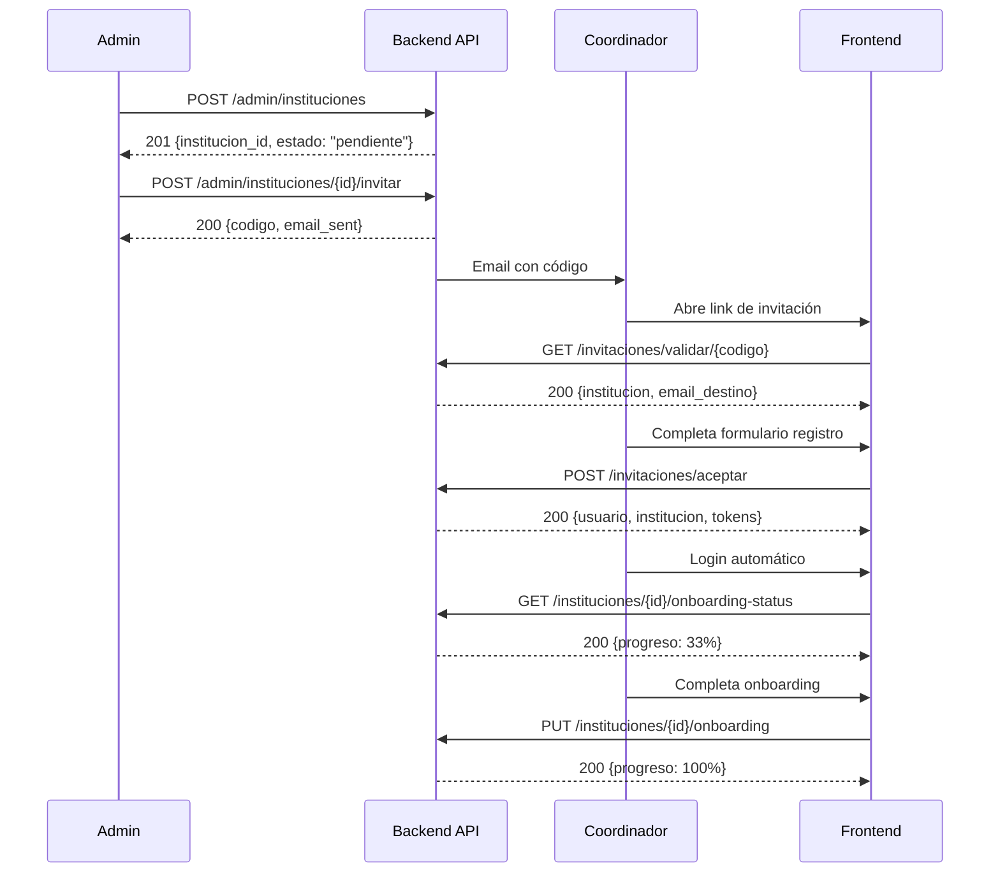

# 🚀 GUÍA DE INTEGRACIÓN FRONTEND: Sistema de Instituciones

**Para**: Equipo de Frontend  
**Fecha**: 6 de noviembre de 2025  
**Versión API**: 1.0

---

## 📋 ÍNDICE

1. [Flujo General](#flujo-general)
2. [Ejemplos de Requests](#ejemplos-de-requests)
3. [Tokens y Autenticación](#tokens-y-autenticación)
4. [Manejo de Errores](#manejo-de-errores)
5. [Estados y Validaciones](#estados-y-validaciones)

---

## 🔄 FLUJO GENERAL



---

## 📡 EJEMPLOS DE REQUESTS

### **FASE 1: Admin Crea Institución**

#### 1.1. Crear Institución

```javascript
// POST /admin/instituciones
const crearInstitucion = async () => {
  const response = await fetch('http://localhost:8000/admin/instituciones', {
    method: 'POST',
    headers: {
      'Content-Type': 'application/json',
      'Authorization': `Bearer ${adminToken}`
    },
    body: JSON.stringify({
      nombre: "Universidad Ejemplo",
      sigla: "UEJEMPLO",
      lema: "Educación de Excelencia",
      tipo_institucion: "universidad",
      usa_programas: true,
      nivel_educativo: "superior",
      sector: "privado",
      modalidad_ensenanza: "presencial",
      pais: "Colombia",
      ciudad: "Bogotá",
      direccion: "Calle 123 #45-67",
      correo_institucional: "info@universidad.edu.co",
      telefono: "+57 1 234 5678",
      nit: "900123456-7"
    })
  });

  const data = await response.json();
  console.log(data);
  // Respuesta:
  // {
  //   "institucion_id": "uuid-generado",
  //   "nombre": "Universidad Ejemplo",
  //   "estado": "pendiente",
  //   "fecha_creacion": "2025-11-06T00:00:00Z"
  // }
};
```

**Campos Obligatorios**:
- ✅ `nombre` (string, 3-150 chars)
- ✅ `tipo_institucion` (enum: universidad, colegio, instituto, etc.)
- ✅ `usa_programas` (boolean)
- ✅ `nivel_educativo` (enum: superior, media, basica, etc.)
- ✅ `sector` (enum: publico, privado)
- ✅ `modalidad_ensenanza` (enum: presencial, virtual, hibrida, dual)
- ✅ `pais` (string)
- ✅ `correo_institucional` (email válido)
- ✅ `telefono` (string)

**Campos Opcionales**:
- `sigla`, `lema`, `ciudad`, `direccion`, `nit`, `logo_url`, `website`

---

#### 1.2. Enviar Invitación a Coordinador

```javascript
// POST /admin/instituciones/{institucion_id}/invitar-coordinador
const invitarCoordinador = async (institucionId, emailCoordinador) => {
  const response = await fetch(
    `http://localhost:8000/admin/instituciones/${institucionId}/invitar-coordinador`,
    {
      method: 'POST',
      headers: {
        'Content-Type': 'application/json',
        'Authorization': `Bearer ${adminToken}`
      },
      body: JSON.stringify({
        email_destino: emailCoordinador
      })
    }
  );

  const data = await response.json();
  console.log(data);
  // Respuesta:
  // {
  //   "id": "uuid-invitacion",
  //   "codigo": "AB12C3",
  //   "email_destino": "coordinador@example.com",
  //   "institucion_id": "uuid-institucion",
  //   "estado": "pendiente",
  //   "fecha_creacion": "2025-11-06T00:00:00Z",
  //   "fecha_expiracion": "2025-11-09T00:00:00Z"
  // }
};
```

**Validaciones Backend**:
- ✅ Institución debe existir
- ✅ Institución debe estar en estado "pendiente"
- ✅ Email debe ser válido
- ✅ Se genera código único de 6 dígitos
- ✅ Expira en 72 horas

---

### **FASE 2: Coordinador Acepta Invitación**

#### 2.1. Validar Código (Página de Registro)

```javascript
// GET /invitaciones/validar/{codigo}
// ⚠️ ENDPOINT PÚBLICO - No requiere autenticación

const validarCodigo = async (codigo) => {
  const response = await fetch(
    `http://localhost:8000/invitaciones/validar/${codigo}`,
    {
      method: 'GET',
      headers: {
        'Content-Type': 'application/json'
      }
    }
  );

  if (!response.ok) {
    const error = await response.json();
    throw new Error(error.detail);
  }

  const data = await response.json();
  return data;
  // Respuesta:
  // {
  //   "valido": true,
  //   "invitacion": {
  //     "id": "uuid",
  //     "codigo": "AB12C3",
  //     "email_destino": "coordinador@example.com",
  //     "fecha_expiracion": "2025-11-09T00:00:00Z"
  //   },
  //   "institucion": {
  //     "id": "uuid",
  //     "nombre": "Universidad Ejemplo",
  //     "sigla": "UEJEMPLO",
  //     "tipo_institucion": "universidad",
  //     "nivel_educativo": "superior",
  //     "ciudad": "Bogotá",
  //     "pais": "Colombia"
  //   }
  // }
};
```

**Uso en Frontend**:
```jsx
// Componente: ValidarInvitacion.jsx
const ValidarInvitacion = () => {
  const [codigo, setCodigo] = useState('');
  const [institucion, setInstitucion] = useState(null);
  const [error, setError] = useState(null);

  const handleValidar = async () => {
    try {
      const data = await validarCodigo(codigo);
      setInstitucion(data.institucion);
      setError(null);
    } catch (err) {
      setError(err.message);
      setInstitucion(null);
    }
  };

  return (
    <div>
      <input 
        value={codigo} 
        onChange={(e) => setCodigo(e.target.value.toUpperCase())}
        maxLength={6}
        placeholder="Ingresa código de 6 dígitos"
      />
      <button onClick={handleValidar}>Validar</button>
      
      {error && <p className="error">{error}</p>}
      
      {institucion && (
        <div className="institucion-info">
          <h3>Serás coordinador de:</h3>
          <h2>{institucion.nombre}</h2>
          <p>{institucion.ciudad}, {institucion.pais}</p>
          {/* Mostrar formulario de registro */}
        </div>
      )}
    </div>
  );
};
```

**Errores Posibles**:
```javascript
// 400 Bad Request
{
  "detail": "Código inválido"
}

// 400 Bad Request
{
  "detail": "El código ya fue usado o expiró"
}

// 400 Bad Request
{
  "detail": "El código ha expirado. Expiró el 2025-11-05T23:59:59Z UTC"
}

// 404 Not Found
{
  "detail": "Institución no encontrada"
}
```

---

#### 2.2. Aceptar Invitación y Registrarse

```javascript
// POST /invitaciones/aceptar
// ⚠️ ENDPOINT PÚBLICO - No requiere autenticación

const aceptarInvitacion = async (codigo, nombre, apellido, password) => {
  const response = await fetch(
    'http://localhost:8000/invitaciones/aceptar',
    {
      method: 'POST',
      headers: {
        'Content-Type': 'application/json'
      },
      body: JSON.stringify({
        codigo: codigo,
        nombre: nombre,
        apellido: apellido,
        password: password
      })
    }
  );

  if (!response.ok) {
    const error = await response.json();
    throw new Error(error.detail);
  }

  const data = await response.json();
  return data;
  // Respuesta:
  // {
  //   "success": true,
  //   "message": "Invitación aceptada exitosamente",
  //   "usuario": {
  //     "id": "uuid-usuario",
  //     "email": "coordinador@example.com",
  //     "username": "coordinador",
  //     "nombre": "Juan",
  //     "apellido": "Pérez",
  //     "rol": "coordinador"
  //   },
  //   "institucion": {
  //     "id": "uuid-institucion",
  //     "nombre": "Universidad Ejemplo",
  //     "sigla": "UEJEMPLO",
  //     "estado": "activa",  // ← CAMBIÓ DE PENDIENTE A ACTIVA
  //     "fecha_activacion": "2025-11-06T00:00:00Z"
  //   }
  // }
};
```

**Validaciones Frontend**:
```javascript
const validarRegistro = (nombre, apellido, password) => {
  const errores = [];
  
  // Nombre
  if (!nombre || nombre.length < 2) {
    errores.push('Nombre debe tener al menos 2 caracteres');
  }
  if (!/^[a-zA-ZáéíóúÁÉÍÓÚñÑ\s]+$/.test(nombre)) {
    errores.push('Nombre solo puede contener letras');
  }
  
  // Apellido
  if (!apellido || apellido.length < 2) {
    errores.push('Apellido debe tener al menos 2 caracteres');
  }
  if (!/^[a-zA-ZáéíóúÁÉÍÓÚñÑ\s]+$/.test(apellido)) {
    errores.push('Apellido solo puede contener letras');
  }
  
  // Contraseña
  if (password.length < 8) {
    errores.push('Contraseña debe tener al menos 8 caracteres');
  }
  if (password.length > 100) {
    errores.push('Contraseña no puede exceder 100 caracteres');
  }
  
  return errores;
};
```

**Uso en Frontend**:
```jsx
// Componente: AceptarInvitacion.jsx
const AceptarInvitacion = ({ codigo, institucion }) => {
  const [nombre, setNombre] = useState('');
  const [apellido, setApellido] = useState('');
  const [password, setPassword] = useState('');
  const [confirmPassword, setConfirmPassword] = useState('');
  const [errores, setErrores] = useState([]);
  const [loading, setLoading] = useState(false);

  const handleSubmit = async (e) => {
    e.preventDefault();
    setErrores([]);
    
    // Validar contraseñas coinciden
    if (password !== confirmPassword) {
      setErrores(['Las contraseñas no coinciden']);
      return;
    }
    
    // Validar campos
    const erroresValidacion = validarRegistro(nombre, apellido, password);
    if (erroresValidacion.length > 0) {
      setErrores(erroresValidacion);
      return;
    }
    
    setLoading(true);
    try {
      const data = await aceptarInvitacion(codigo, nombre, apellido, password);
      
      // ✅ Registro exitoso
      // Hacer login automático con las credenciales
      const loginData = await login(data.usuario.email, password);
      
      // Guardar tokens
      localStorage.setItem('access_token', loginData.access_token);
      localStorage.setItem('refresh_token', loginData.refresh_token);
      
      // Redirigir a onboarding
      window.location.href = `/instituciones/${data.institucion.id}/onboarding`;
      
    } catch (err) {
      setErrores([err.message]);
    } finally {
      setLoading(false);
    }
  };

  return (
    <form onSubmit={handleSubmit}>
      <h2>Completa tu Registro</h2>
      <p>Institución: <strong>{institucion.nombre}</strong></p>
      
      {errores.length > 0 && (
        <div className="error-box">
          {errores.map((error, i) => (
            <p key={i}>{error}</p>
          ))}
        </div>
      )}
      
      <input 
        type="text"
        placeholder="Nombre"
        value={nombre}
        onChange={(e) => setNombre(e.target.value)}
        required
      />
      
      <input 
        type="text"
        placeholder="Apellido"
        value={apellido}
        onChange={(e) => setApellido(e.target.value)}
        required
      />
      
      <input 
        type="password"
        placeholder="Contraseña (mínimo 8 caracteres)"
        value={password}
        onChange={(e) => setPassword(e.target.value)}
        required
      />
      
      <input 
        type="password"
        placeholder="Confirmar contraseña"
        value={confirmPassword}
        onChange={(e) => setConfirmPassword(e.target.value)}
        required
      />
      
      <button type="submit" disabled={loading}>
        {loading ? 'Procesando...' : 'Aceptar y Crear Cuenta'}
      </button>
    </form>
  );
};
```

---

### **FASE 3: Coordinador Completa Onboarding**

#### 3.1. Ver Estado del Onboarding

```javascript
// GET /api/instituciones/{institucion_id}/onboarding-status
// ⚠️ REQUIERE AUTENTICACIÓN (coordinador)

const obtenerEstadoOnboarding = async (institucionId, token) => {
  const response = await fetch(
    `http://localhost:8000/api/instituciones/${institucionId}/onboarding-status`,
    {
      method: 'GET',
      headers: {
        'Authorization': `Bearer ${token}`
      }
    }
  );

  const data = await response.json();
  return data;
  // Respuesta:
  // {
  //   "onboarding_completo": false,
  //   "pasos_completados": {
  //     "informacion_basica": true,
  //     "branding": false,
  //     "contacto": false,
  //     "redes_sociales": false,
  //     "dominios": false,
  //     "acreditacion": false
  //   },
  //   "pasos_faltantes": [
  //     "branding",
  //     "contacto",
  //     "redes_sociales",
  //     "dominios",
  //     "acreditacion"
  //   ],
  //   "porcentaje_completado": 17
  // }
};
```

**Uso en Frontend - Barra de Progreso**:
```jsx
// Componente: OnboardingProgress.jsx
const OnboardingProgress = ({ institucionId }) => {
  const [estado, setEstado] = useState(null);
  const token = localStorage.getItem('access_token');

  useEffect(() => {
    obtenerEstadoOnboarding(institucionId, token)
      .then(setEstado);
  }, [institucionId]);

  if (!estado) return <div>Cargando...</div>;

  return (
    <div className="onboarding-progress">
      <h3>Progreso de Configuración</h3>
      
      <div className="progress-bar">
        <div 
          className="progress-fill" 
          style={{ width: `${estado.porcentaje_completado}%` }}
        >
          {estado.porcentaje_completado}%
        </div>
      </div>
      
      <div className="pasos-list">
        {Object.entries(estado.pasos_completados).map(([paso, completado]) => (
          <div key={paso} className={completado ? 'completado' : 'pendiente'}>
            <span className="icon">{completado ? '✅' : '⏳'}</span>
            <span className="texto">{paso.replace('_', ' ')}</span>
          </div>
        ))}
      </div>
      
      {!estado.onboarding_completo && (
        <button onClick={() => navigate('onboarding')}>
          Completar Configuración
        </button>
      )}
    </div>
  );
};
```

---

#### 3.2. Completar Onboarding (Formulario Completo)

```javascript
// PUT /api/instituciones/{institucion_id}/onboarding
// ⚠️ REQUIERE AUTENTICACIÓN (coordinador)

const completarOnboarding = async (institucionId, data, token) => {
  const response = await fetch(
    `http://localhost:8000/api/instituciones/${institucionId}/onboarding`,
    {
      method: 'PUT',
      headers: {
        'Content-Type': 'application/json',
        'Authorization': `Bearer ${token}`
      },
      body: JSON.stringify(data)
    }
  );

  return await response.json();
};

// Ejemplo de uso:
const datosOnboarding = {
  // Branding
  logo_url: "https://cdn.example.com/logos/universidad.png",
  color_primario: "#003366",
  color_secundario: "#FFD700",
  
  // Contacto
  direccion: "Calle 123 #45-67, Edificio Principal",
  ciudad: "Bogotá",
  telefono: "+57 1 234 5678",
  website: "https://www.universidad.edu.co",
  
  // Redes sociales
  redes_sociales: {
    facebook: "https://facebook.com/universidadejemplo",
    instagram: "https://instagram.com/universidadejemplo",
    linkedin: "https://linkedin.com/school/universidadejemplo",
    twitter: "https://twitter.com/universidadejemplo"
  },
  
  // Académico
  jornadas: ["mañana", "tarde", "noche"],
  
  // Dominios adicionales
  dominios_adicionales: [
    "estudiantes.universidad.edu.co",
    "docentes.universidad.edu.co"
  ],
  
  // Configuración regional
  configuracion_regional: {
    idioma: "es",
    zona_horaria: "America/Bogota",
    moneda: "COP"
  },
  
  // Acreditación
  acreditacion_nacional: "Acreditación de Alta Calidad - Ministerio de Educación",
  acreditacion_internacional: "QS World University Rankings 2025"
};

const resultado = await completarOnboarding(
  'uuid-institucion',
  datosOnboarding,
  token
);
```

**Formulario Multi-Paso en Frontend**:
```jsx
// Componente: OnboardingWizard.jsx
const OnboardingWizard = ({ institucionId }) => {
  const [paso, setPaso] = useState(1);
  const [datos, setDatos] = useState({
    logo_url: '',
    color_primario: '#000000',
    color_secundario: '#FFFFFF',
    direccion: '',
    ciudad: '',
    telefono: '',
    website: '',
    redes_sociales: {},
    jornadas: [],
    dominios_adicionales: [],
    configuracion_regional: {},
    acreditacion_nacional: '',
    acreditacion_internacional: ''
  });

  const pasos = [
    { numero: 1, titulo: 'Branding', componente: <PasoBranding /> },
    { numero: 2, titulo: 'Contacto', componente: <PasoContacto /> },
    { numero: 3, titulo: 'Redes Sociales', componente: <PasoRedes /> },
    { numero: 4, titulo: 'Configuración', componente: <PasoConfig /> }
  ];

  const siguiente = () => setPaso(paso + 1);
  const anterior = () => setPaso(paso - 1);
  
  const finalizar = async () => {
    try {
      const token = localStorage.getItem('access_token');
      const resultado = await completarOnboarding(institucionId, datos, token);
      
      if (resultado.success) {
        // Mostrar éxito y redirigir a dashboard
        toast.success('¡Configuración completa!');
        navigate(`/instituciones/${institucionId}/dashboard`);
      }
    } catch (error) {
      toast.error(error.message);
    }
  };

  return (
    <div className="onboarding-wizard">
      <div className="pasos-header">
        {pasos.map(p => (
          <div 
            key={p.numero}
            className={p.numero <= paso ? 'activo' : 'inactivo'}
          >
            {p.numero}. {p.titulo}
          </div>
        ))}
      </div>
      
      <div className="paso-contenido">
        {React.cloneElement(pasos[paso - 1].componente, {
          datos,
          setDatos
        })}
      </div>
      
      <div className="botones">
        {paso > 1 && (
          <button onClick={anterior}>Anterior</button>
        )}
        
        {paso < pasos.length ? (
          <button onClick={siguiente}>Siguiente</button>
        ) : (
          <button onClick={finalizar}>Finalizar</button>
        )}
      </div>
    </div>
  );
};

// Paso 1: Branding
const PasoBranding = ({ datos, setDatos }) => {
  const [preview, setPreview] = useState(null);
  
  const handleColorChange = (tipo, valor) => {
    setDatos(prev => ({
      ...prev,
      [tipo]: valor
    }));
  };

  return (
    <div className="paso-branding">
      <h2>Personaliza tu Institución</h2>
      
      {/* Upload logo */}
      <div className="logo-upload">
        <label>Logo Institucional</label>
        <input 
          type="file"
          accept="image/*"
          onChange={(e) => {
            // Subir a CDN y obtener URL
            // uploadLogo(e.target.files[0]).then(url => {
            //   setDatos(prev => ({ ...prev, logo_url: url }));
            // });
          }}
        />
        {preview && }
      </div>
      
      {/* Colores */}
      <div className="color-pickers">
        <div>
          <label>Color Primario</label>
          <input 
            type="color"
            value={datos.color_primario}
            onChange={(e) => handleColorChange('color_primario', e.target.value)}
          />
        </div>
        
        <div>
          <label>Color Secundario</label>
          <input 
            type="color"
            value={datos.color_secundario}
            onChange={(e) => handleColorChange('color_secundario', e.target.value)}
          />
        </div>
      </div>
      
      {/* Preview */}
      <div 
        className="color-preview"
        style={{
          backgroundColor: datos.color_primario,
          color: datos.color_secundario
        }}
      >
        Vista Previa de Colores
      </div>
    </div>
  );
};
```

---

#### 3.3. Actualizar Solo Branding (Rápido)

```javascript
// PUT /api/instituciones/{institucion_id}/branding
// ⚠️ REQUIERE AUTENTICACIÓN (coordinador)

const actualizarBranding = async (institucionId, branding, token) => {
  const response = await fetch(
    `http://localhost:8000/api/instituciones/${institucionId}/branding`,
    {
      method: 'PUT',
      headers: {
        'Content-Type': 'application/json',
        'Authorization': `Bearer ${token}`
      },
      body: JSON.stringify(branding)
    }
  );

  return await response.json();
};

// Uso:
const nuevoBranding = {
  logo_url: "https://cdn.example.com/new-logo.png",
  color_primario: "#FF5733",
  color_secundario: "#C70039"
};

const resultado = await actualizarBranding(
  'uuid-institucion',
  nuevoBranding,
  token
);
// Respuesta:
// {
//   "success": true,
//   "message": "Branding actualizado exitosamente",
//   "data": {
//     "institucion_id": "uuid",
//     "nombre": "Universidad Ejemplo",
//     "logo_url": "https://cdn.example.com/new-logo.png",
//     "color_primario": "#FF5733",
//     "color_secundario": "#C70039"
//   }
// }
```

---

#### 3.4. Agregar Dominio Adicional

```javascript
// POST /api/instituciones/{institucion_id}/dominios
// ⚠️ REQUIERE AUTENTICACIÓN (coordinador)

const agregarDominio = async (institucionId, dominio, token) => {
  const response = await fetch(
    `http://localhost:8000/api/instituciones/${institucionId}/dominios`,
    {
      method: 'POST',
      headers: {
        'Content-Type': 'application/json',
        'Authorization': `Bearer ${token}`
      },
      body: JSON.stringify({ dominio })
    }
  );

  if (!response.ok) {
    const error = await response.json();
    throw new Error(error.detail);
  }

  return await response.json();
};

// Uso:
try {
  const resultado = await agregarDominio(
    'uuid-institucion',
    'estudiantes.universidad.edu.co',
    token
  );
  
  console.log(resultado);
  // {
  //   "success": true,
  //   "message": "Dominio agregado exitosamente",
  //   "data": {
  //     "institucion_id": "uuid",
  //     "nombre": "Universidad Ejemplo",
  //     "dominio_principal": "universidad.edu.co",
  //     "dominios_adicionales": [
  //       "estudiantes.universidad.edu.co"
  //     ]
  //   }
  // }
} catch (error) {
  console.error('Error:', error.message);
  // Posibles errores:
  // - "Este dominio ya es el dominio principal de la institución"
  // - "Este dominio ya está registrado en la institución"
  // - "Este dominio ya está registrado por otra institución: ..."
}
```

**Componente de Gestión de Dominios**:
```jsx
// Componente: GestionDominios.jsx
const GestionDominios = ({ institucion }) => {
  const [nuevoDominio, setNuevoDominio] = useState('');
  const [dominios, setDominios] = useState(institucion.dominios_adicionales || []);
  const [error, setError] = useState(null);
  const token = localStorage.getItem('access_token');

  const handleAgregar = async () => {
    setError(null);
    try {
      const resultado = await agregarDominio(
        institucion.institucion_id,
        nuevoDominio,
        token
      );
      
      setDominios(resultado.data.dominios_adicionales);
      setNuevoDominio('');
      toast.success('Dominio agregado exitosamente');
    } catch (err) {
      setError(err.message);
    }
  };

  return (
    <div className="gestion-dominios">
      <h3>Dominios para Registro Automático</h3>
      
      <div className="dominio-principal">
        <strong>Dominio Principal:</strong> {institucion.dominio_principal}
      </div>
      
      <div className="agregar-dominio">
        <input 
          type="text"
          placeholder="Ej: estudiantes.universidad.edu.co"
          value={nuevoDominio}
          onChange={(e) => setNuevoDominio(e.target.value.toLowerCase())}
        />
        <button onClick={handleAgregar}>Agregar</button>
      </div>
      
      {error && <p className="error">{error}</p>}
      
      <div className="dominios-list">
        <h4>Dominios Adicionales</h4>
        {dominios.length === 0 ? (
          <p>No hay dominios adicionales configurados</p>
        ) : (
          <ul>
            {dominios.map((dominio, i) => (
              <li key={i}>{dominio}</li>
            ))}
          </ul>
        )}
      </div>
      
      <div className="info">
        <p>Los usuarios con email de estos dominios podrán registrarse automáticamente en tu institución.</p>
      </div>
    </div>
  );
};
```

---

## 🔐 TOKENS Y AUTENTICACIÓN

### Login de Coordinador (Después de Aceptar Invitación)

```javascript
// POST /auth/login
const login = async (email, password) => {
  const response = await fetch('http://localhost:8000/auth/login', {
    method: 'POST',
    headers: {
      'Content-Type': 'application/json'
    },
    body: JSON.stringify({
      email: email,  // o username para admin
      password: password
    })
  });

  const data = await response.json();
  return data;
  // Respuesta:
  // {
  //   "access_token": "eyJhbGciOiJIUzI1NiIsInR5cCI6IkpXVCJ9...",
  //   "refresh_token": "eyJhbGciOiJIUzI1NiIsInR5cCI6IkpXVCJ9...",
  //   "token_type": "bearer",
  //   "expires_in": 3600
  // }
};
```

### Uso de Tokens

```javascript
// Guardar tokens después del login
const handleLogin = async (email, password) => {
  const data = await login(email, password);
  
  // Guardar en localStorage
  localStorage.setItem('access_token', data.access_token);
  localStorage.setItem('refresh_token', data.refresh_token);
  
  // O guardar en cookies (más seguro)
  document.cookie = `access_token=${data.access_token}; secure; httpOnly`;
};

// Usar token en requests
const hacerRequestAutenticado = async (url) => {
  const token = localStorage.getItem('access_token');
  
  const response = await fetch(url, {
    headers: {
      'Authorization': `Bearer ${token}`
    }
  });
  
  return await response.json();
};
```

### Renovar Token Expirado

```javascript
// POST /auth/refresh
const renovarToken = async () => {
  const refreshToken = localStorage.getItem('refresh_token');
  
  const response = await fetch('http://localhost:8000/auth/refresh', {
    method: 'POST',
    headers: {
      'Authorization': `Bearer ${refreshToken}`
    }
  });
  
  const data = await response.json();
  
  // Actualizar access token
  localStorage.setItem('access_token', data.access_token);
  
  return data.access_token;
};

// Interceptor para renovar automáticamente
const fetchWithAuth = async (url, options = {}) => {
  const token = localStorage.getItem('access_token');
  
  options.headers = {
    ...options.headers,
    'Authorization': `Bearer ${token}`
  };
  
  let response = await fetch(url, options);
  
  // Si token expiró (401), renovar y reintentar
  if (response.status === 401) {
    const nuevoToken = await renovarToken();
    
    options.headers['Authorization'] = `Bearer ${nuevoToken}`;
    response = await fetch(url, options);
  }
  
  return response;
};
```

---

## ⚠️ MANEJO DE ERRORES

### Errores Comunes y Respuestas

```javascript
// Helper para manejar errores
const handleAPIError = (error) => {
  switch (error.status) {
    case 400:
      return {
        titulo: 'Datos Inválidos',
        mensaje: error.detail,
        tipo: 'warning'
      };
      
    case 401:
      return {
        titulo: 'No Autorizado',
        mensaje: 'Debes iniciar sesión para continuar',
        tipo: 'error',
        accion: () => window.location.href = '/login'
      };
      
    case 403:
      return {
        titulo: 'Acceso Denegado',
        mensaje: 'No tienes permisos para realizar esta acción',
        tipo: 'error'
      };
      
    case 404:
      return {
        titulo: 'No Encontrado',
        mensaje: error.detail || 'El recurso solicitado no existe',
        tipo: 'warning'
      };
      
    case 500:
      return {
        titulo: 'Error del Servidor',
        mensaje: 'Ocurrió un error inesperado. Por favor intenta más tarde.',
        tipo: 'error'
      };
      
    default:
      return {
        titulo: 'Error',
        mensaje: error.detail || 'Ocurrió un error desconocido',
        tipo: 'error'
      };
  }
};

// Uso en componente
const ComponenteEjemplo = () => {
  const [error, setError] = useState(null);

  const hacerAlgo = async () => {
    try {
      const data = await algunaFuncion();
      // ...
    } catch (err) {
      const errorInfo = handleAPIError(err);
      setError(errorInfo);
      
      // Mostrar toast
      toast[errorInfo.tipo](errorInfo.mensaje);
      
      // Ejecutar acción si existe
      if (errorInfo.accion) {
        errorInfo.accion();
      }
    }
  };

  return (
    <div>
      {error && (
        <div className={`alert alert-${error.tipo}`}>
          <h4>{error.titulo}</h4>
          <p>{error.mensaje}</p>
        </div>
      )}
      {/* ... */}
    </div>
  );
};
```

---

## 📝 VALIDACIONES Y ESTADOS

### Estados de Institución

```javascript
const ESTADOS_INSTITUCION = {
  PENDIENTE: 'pendiente',  // Admin creó, esperando coordinador
  ACTIVA: 'activa',        // Coordinador aceptó invitación
  SUSPENDIDA: 'suspendida', // Admin suspendió temporalmente
  INACTIVA: 'inactiva'     // Desactivada permanentemente
};

// Badges para estados
const EstadoBadge = ({ estado }) => {
  const config = {
    pendiente: { texto: 'Pendiente', color: 'warning', icono: '⏳' },
    activa: { texto: 'Activa', color: 'success', icono: '✅' },
    suspendida: { texto: 'Suspendida', color: 'danger', icono: '⚠️' },
    inactiva: { texto: 'Inactiva', color: 'secondary', icono: '❌' }
  };
  
  const { texto, color, icono } = config[estado] || config.pendiente;
  
  return (
    <span className={`badge badge-${color}`}>
      {icono} {texto}
    </span>
  );
};
```

### Validaciones de Campos

```javascript
// Validadores reutilizables
const validadores = {
  nombre: (valor) => {
    if (!valor || valor.length < 3) {
      return 'Nombre debe tener al menos 3 caracteres';
    }
    if (valor.length > 150) {
      return 'Nombre no puede exceder 150 caracteres';
    }
    return null;
  },
  
  email: (valor) => {
    const regex = /^[^\s@]+@[^\s@]+\.[^\s@]+$/;
    if (!regex.test(valor)) {
      return 'Email inválido';
    }
    return null;
  },
  
  telefono: (valor) => {
    if (!valor) return 'Teléfono es obligatorio';
    if (valor.length < 7) {
      return 'Teléfono debe tener al menos 7 dígitos';
    }
    return null;
  },
  
  colorHex: (valor) => {
    const regex = /^#[0-9A-Fa-f]{6}$/;
    if (!regex.test(valor)) {
      return 'Color debe estar en formato hexadecimal (#RRGGBB)';
    }
    return null;
  },
  
  dominio: (valor) => {
    if (valor.includes('@')) {
      return 'No incluyas @ en el dominio';
    }
    const regex = /^[a-zA-Z0-9]([a-zA-Z0-9-]{0,61}[a-zA-Z0-9])?(\.[a-zA-Z0-9]([a-zA-Z0-9-]{0,61}[a-zA-Z0-9])?)*$/;
    if (!regex.test(valor)) {
      return 'Formato de dominio inválido';
    }
    return null;
  }
};

// Hook personalizado para validación de formulario
const useFormValidation = (campos, validaciones) => {
  const [errores, setErrores] = useState({});
  
  const validar = (nombre, valor) => {
    if (validaciones[nombre]) {
      const error = validaciones[nombre](valor);
      setErrores(prev => ({
        ...prev,
        [nombre]: error
      }));
      return !error;
    }
    return true;
  };
  
  const validarTodo = (valores) => {
    const nuevosErrores = {};
    let esValido = true;
    
    Object.keys(validaciones).forEach(campo => {
      const error = validaciones[campo](valores[campo]);
      if (error) {
        nuevosErrores[campo] = error;
        esValido = false;
      }
    });
    
    setErrores(nuevosErrores);
    return esValido;
  };
  
  return { errores, validar, validarTodo };
};

// Uso:
const FormularioEjemplo = () => {
  const [datos, setDatos] = useState({
    nombre: '',
    email: '',
    telefono: ''
  });
  
  const { errores, validar, validarTodo } = useFormValidation(datos, {
    nombre: validadores.nombre,
    email: validadores.email,
    telefono: validadores.telefono
  });
  
  const handleChange = (campo, valor) => {
    setDatos(prev => ({ ...prev, [campo]: valor }));
    validar(campo, valor);
  };
  
  const handleSubmit = (e) => {
    e.preventDefault();
    if (validarTodo(datos)) {
      // Submit
    }
  };
  
  return (
    <form onSubmit={handleSubmit}>
      <div>
        <input 
          value={datos.nombre}
          onChange={(e) => handleChange('nombre', e.target.value)}
        />
        {errores.nombre && <span className="error">{errores.nombre}</span>}
      </div>
      {/* ... más campos */}
    </form>
  );
};
```

---

## 📱 EJEMPLO COMPLETO: Flujo de Onboarding

```jsx
// App.jsx - Rutas principales
import { BrowserRouter, Routes, Route } from 'react-router-dom';

function App() {
  return (
    <BrowserRouter>
      <Routes>
        {/* Rutas públicas */}
        <Route path="/invitacion/:codigo" element={<ValidarInvitacion />} />
        <Route path="/registro/:codigo" element={<RegistroCoordinador />} />
        
        {/* Rutas protegidas (coordinador) */}
        <Route path="/instituciones/:id/onboarding" element={<OnboardingWizard />} />
        <Route path="/instituciones/:id/dashboard" element={<DashboardInstitucion />} />
        <Route path="/instituciones/:id/configuracion" element={<ConfiguracionInstitucion />} />
        
        {/* Rutas admin */}
        <Route path="/admin/instituciones" element={<AdminInstituciones />} />
      </Routes>
    </BrowserRouter>
  );
}

// ValidarInvitacion.jsx - Página inicial
const ValidarInvitacion = () => {
  const { codigo } = useParams();
  const [institucion, setInstitucion] = useState(null);
  const [loading, setLoading] = useState(true);
  const [error, setError] = useState(null);
  const navigate = useNavigate();

  useEffect(() => {
    const validar = async () => {
      try {
        const data = await validarCodigo(codigo);
        setInstitucion(data.institucion);
      } catch (err) {
        setError(err.message);
      } finally {
        setLoading(false);
      }
    };
    
    validar();
  }, [codigo]);

  if (loading) return <LoadingSpinner />;
  if (error) return <ErrorPage mensaje={error} />;

  return (
    <div className="validar-invitacion">
      <div className="hero">
        <h1>¡Has sido invitado!</h1>
        <h2>Serás coordinador de:</h2>
      </div>
      
      <div className="institucion-card">
        <h3>{institucion.nombre}</h3>
        <p>{institucion.ciudad}, {institucion.pais}</p>
        <p>{institucion.tipo_institucion} - {institucion.nivel_educativo}</p>
      </div>
      
      <button 
        className="btn-primary"
        onClick={() => navigate(`/registro/${codigo}`)}
      >
        Aceptar y Crear Cuenta
      </button>
    </div>
  );
};

// RegistroCoordinador.jsx - Formulario de registro
const RegistroCoordinador = () => {
  const { codigo } = useParams();
  const navigate = useNavigate();
  const [datos, setDatos] = useState({
    nombre: '',
    apellido: '',
    password: '',
    confirmPassword: ''
  });
  const [errores, setErrores] = useState([]);
  const [loading, setLoading] = useState(false);

  const handleSubmit = async (e) => {
    e.preventDefault();
    setErrores([]);
    
    // Validar
    if (datos.password !== datos.confirmPassword) {
      setErrores(['Las contraseñas no coinciden']);
      return;
    }
    
    const erroresValidacion = validarRegistro(
      datos.nombre,
      datos.apellido,
      datos.password
    );
    
    if (erroresValidacion.length > 0) {
      setErrores(erroresValidacion);
      return;
    }
    
    // Registrar
    setLoading(true);
    try {
      const resultado = await aceptarInvitacion(
        codigo,
        datos.nombre,
        datos.apellido,
        datos.password
      );
      
      // Login automático
      const loginData = await login(
        resultado.usuario.email,
        datos.password
      );
      
      localStorage.setItem('access_token', loginData.access_token);
      localStorage.setItem('user', JSON.stringify(resultado.usuario));
      
      // Redirigir a onboarding
      navigate(`/instituciones/${resultado.institucion.id}/onboarding`);
      
    } catch (err) {
      setErrores([err.message]);
    } finally {
      setLoading(false);
    }
  };

  return (
    <div className="registro-coordinador">
      <h1>Completa tu Registro</h1>
      
      {errores.length > 0 && (
        <div className="alert alert-danger">
          {errores.map((error, i) => (
            <p key={i}>{error}</p>
          ))}
        </div>
      )}
      
      <form onSubmit={handleSubmit}>
        <div className="form-group">
          <label>Nombre</label>
          <input 
            type="text"
            value={datos.nombre}
            onChange={(e) => setDatos({...datos, nombre: e.target.value})}
            required
          />
        </div>
        
        <div className="form-group">
          <label>Apellido</label>
          <input 
            type="text"
            value={datos.apellido}
            onChange={(e) => setDatos({...datos, apellido: e.target.value})}
            required
          />
        </div>
        
        <div className="form-group">
          <label>Contraseña</label>
          <input 
            type="password"
            value={datos.password}
            onChange={(e) => setDatos({...datos, password: e.target.value})}
            required
            minLength={8}
          />
          <small>Mínimo 8 caracteres</small>
        </div>
        
        <div className="form-group">
          <label>Confirmar Contraseña</label>
          <input 
            type="password"
            value={datos.confirmPassword}
            onChange={(e) => setDatos({...datos, confirmPassword: e.target.value})}
            required
          />
        </div>
        
        <button 
          type="submit"
          className="btn-primary"
          disabled={loading}
        >
          {loading ? 'Procesando...' : 'Crear Cuenta'}
        </button>
      </form>
    </div>
  );
};

// OnboardingWizard.jsx - Ya mostrado anteriormente
```

---

## 🎨 COMPONENTES DE UI RECOMENDADOS

```jsx
// LoadingSpinner.jsx
const LoadingSpinner = () => (
  <div className="loading-spinner">
    <div className="spinner"></div>
    <p>Cargando...</p>
  </div>
);

// Toast.jsx - Notificaciones
import { Toaster, toast } from 'react-hot-toast';

export const Toast = () => <Toaster position="top-right" />;

export const showToast = {
  success: (msg) => toast.success(msg),
  error: (msg) => toast.error(msg),
  info: (msg) => toast(msg, { icon: 'ℹ️' })
};

// ColorPicker.jsx - Selector de colores
const ColorPicker = ({ value, onChange, label }) => {
  const [showPicker, setShowPicker] = useState(false);
  
  return (
    <div className="color-picker">
      <label>{label}</label>
      <div className="picker-container">
        <div 
          className="color-preview"
          style={{ backgroundColor: value }}
          onClick={() => setShowPicker(!showPicker)}
        />
        <input 
          type="text"
          value={value}
          onChange={(e) => onChange(e.target.value)}
        />
      </div>
      {showPicker && (
        <SketchPicker 
          color={value}
          onChangeComplete={(color) => onChange(color.hex)}
        />
      )}
    </div>
  );
};

// ProgressBar.jsx - Barra de progreso
const ProgressBar = ({ porcentaje, mostrarTexto = true }) => (
  <div className="progress-bar-container">
    <div 
      className="progress-bar-fill"
      style={{ width: `${porcentaje}%` }}
    >
      {mostrarTexto && <span>{porcentaje}%</span>}
    </div>
  </div>
);
```

---

## 📞 SOPORTE

**Documentación API Completa**: http://localhost:8000/docs  
**Repositorio Backend**: Ver archivos en `/backend/Docs/`  
**Contacto Backend Team**: [Tu contacto]

---

**Fin de la Guía**  
**Versión**: 1.0  
**Última Actualización**: 6 de noviembre de 2025
