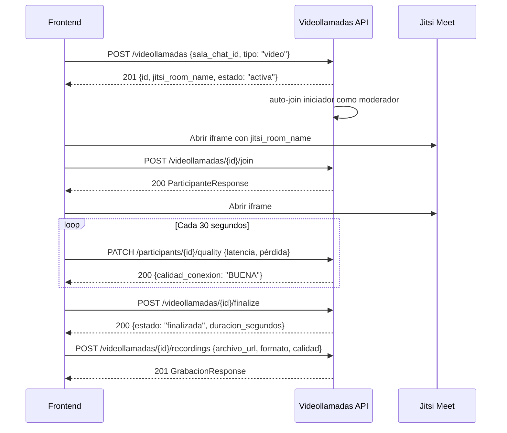

# 📹 Sistema de Videollamadas - Guía de Integración

## 📋 Resumen Ejecutivo

Sistema completo de videollamadas refactorizado con arquitectura de 3 capas, principios SOLID, enums para type-safety y service layer robusto.

**Estado**: ✅ **100% FUNCIONAL - 20/20 Tests Pasando**

---

## 🏗️ Arquitectura

### Capas del Sistema

```
┌─────────────────────────────────────────┐
│         API REST (FastAPI)              │
│    /api/communication/videollamadas     │
└──────────────┬──────────────────────────┘
               │
┌──────────────▼──────────────────────────┐
│      Service Layer (Business Logic)     │
│     VideollamadaService (16 métodos)    │
└──────────────┬──────────────────────────┘
               │
┌──────────────▼──────────────────────────┐
│         CRUD Layer (Data Access)        │
│    videollamada_crud (6 métodos)        │
└──────────────┬──────────────────────────┘
               │
┌──────────────▼──────────────────────────┐
│      Database (PostgreSQL + Enums)      │
│  videollamadas, participantes, grabac.  │
└─────────────────────────────────────────┘
```

### Principios SOLID Aplicados

✅ **Single Responsibility**: Cada clase/función tiene una única responsabilidad  
✅ **Open/Closed**: Extensible sin modificar código existente  
✅ **Liskov Substitution**: Responses intercambiables  
✅ **Interface Segregation**: Endpoints específicos y enfocados  
✅ **Dependency Inversion**: Depende de abstracciones (Service Layer)

---

## 🎯 Enums y Type-Safety

### 6 Enums con Métodos de Negocio

#### 1. TipoLlamada
```python
class TipoLlamada(str, Enum):
    VIDEO = "video"  # Videollamada con cámara
    VOZ = "voz"      # Solo audio
```

#### 2. EstadoVideollamada
```python
class EstadoVideollamada(str, Enum):
    PROGRAMADA = "programada"  # Agendada para el futuro
    ACTIVA = "activa"          # En curso ahora
    FINALIZADA = "finalizada"  # Terminada normalmente
    CANCELADA = "cancelada"    # Cancelada antes de iniciar

    def puede_transicionar_a(self, nuevo_estado) -> bool:
        """Valida transiciones de estado permitidas."""
        # PROGRAMADA → ACTIVA, CANCELADA
        # ACTIVA → FINALIZADA, CANCELADA
        # FINALIZADA/CANCELADA → no transitions
```

#### 3. CalidadConexion
```python
class CalidadConexion(str, Enum):
    EXCELENTE = "EXCELENTE"  # < 50ms latencia, < 1% pérdida
    BUENA = "BUENA"          # < 100ms, < 3%
    REGULAR = "REGULAR"      # < 200ms, < 5%
    MALA = "MALA"            # >= 200ms o >= 5%

    @classmethod
    def desde_metricas(cls, latencia_ms: int, perdida_paquetes_pct: float):
        """Calcula calidad desde métricas de red."""
        if latencia_ms < 50 and perdida_paquetes_pct < 1.0:
            return cls.EXCELENTE
        # ... lógica completa
```

#### 4. FormatoGrabacion
```python
class FormatoGrabacion(str, Enum):
    MP4 = "mp4"    # MPEG-4 (recomendado)
    WEBM = "webm"  # WebM (eficiente web)
    MKV = "mkv"    # Matroska (alta calidad)
    AVI = "avi"    # Legacy

    @property
    def mime_type(self) -> str:
        """Retorna MIME type: video/mp4, etc."""
```

#### 5. CalidadGrabacion
```python
class CalidadGrabacion(str, Enum):
    SD = "SD"      # 720x480, ~5000 kbps
    HD = "HD"      # 1280x720, ~8000 kbps
    FHD = "FHD"    # 1920x1080, ~12000 kbps
    UHD_4K = "4K"  # 3840x2160, ~15000 kbps

    @property
    def resolucion(self) -> tuple[int, int]:
        """Retorna (ancho, alto) en píxeles."""
    
    @property
    def bitrate_recomendado_kbps(self) -> int:
        """Bitrate recomendado."""
```

#### 6. EstadoProcesamiento
```python
class EstadoProcesamiento(str, Enum):
    PENDIENTE = "PENDIENTE"      # Esperando procesamiento
    PROCESANDO = "PROCESANDO"    # En proceso
    COMPLETADO = "COMPLETADO"    # Listo
    ERROR = "ERROR"              # Falló

    @property
    def es_final(self) -> bool:
        """True si es estado terminal."""
```

---

## 🚀 API Endpoints

### Base URL
```
/api/communication/videollamadas
```

### 📌 Rutas Disponibles (19 endpoints)

#### 🏥 Health Check
```http
GET /health
```
**Response**: `{ "success": true, "message": "..." }`

---

#### 📝 CRUD de Videollamadas

##### 1. Crear Videollamada
```http
POST /
Content-Type: application/json
Authorization: Bearer <token>

{
  "tipo_llamada": "video",           // "video" | "voz"
  "sala_chat_id": "uuid",             // UUID de sala (opcional)
  "jitsi_room_name": "mi-sala",      // Opcional, se genera automático
  "titulo": "Reunión de equipo",     // Opcional
  "descripcion": "...",               // Opcional
  "configuracion": {                  // Opcional
    "max_participantes": 50,
    "permitir_grabacion": true
  }
}
```

**Response** `201 Created`:
```json
{
  "id": "uuid",
  "jitsi_room_name": "mi-sala-123",
  "tipo_llamada": "video",
  "sala_chat_id": "uuid",
  "iniciador_id": "uuid",
  "estado": "activa",
  "fecha_inicio": "2025-11-01T14:30:00Z",
  "fecha_fin": null,
  "duracion_segundos": null,
  "grabacion_url": null,
  "transcripcion": null,
  "resumen_ia": null,
  "created_at": "2025-11-01T14:30:00Z",
  "updated_at": "2025-11-01T14:30:00Z",
  "total_participantes": null,
  "participantes_activos": null
}
```

##### 2. Obtener Videollamada
```http
GET /{videollamada_id}?incluir_participantes=true
Authorization: Bearer <token>
```

**Query Params**:
- `incluir_participantes`: boolean (default: false)

**Response** `200 OK`: VideollamadaResponse (ver arriba)

##### 3. Listar Videollamadas
```http
GET /?sala_chat_id=uuid&solo_activas=true&skip=0&limit=50
Authorization: Bearer <token>
```

**Query Params**:
- `sala_chat_id`: UUID (opcional) - filtrar por sala
- `solo_activas`: boolean (default: false) - solo estado ACTIVA
- `skip`: int (default: 0) - paginación
- `limit`: int (default: 50, max: 100) - items por página

**Response** `200 OK`:
```json
{
  "items": [VideollamadaResponse, ...],
  "total": 120,
  "skip": 0,
  "limit": 50,
  "has_more": true
}
```

---

#### 👥 Gestión de Participantes

##### 4. Unirse a Videollamada
```http
POST /{videollamada_id}/join
Content-Type: application/json
Authorization: Bearer <token>

{
  "es_moderador": false  // opcional, default: false
}
```

**Response** `200 OK`:
```json
{
  "id": "uuid",
  "videollamada_id": "uuid",
  "usuario_id": "uuid",
  "es_moderador": false,
  "fecha_union": "2025-11-01T14:35:00Z",
  "fecha_salida": null,
  "duracion_segundos": null,
  "calidad_conexion": null,
  "datos_conexion": {},
  "created_at": "2025-11-01T14:35:00Z"
}
```

**Errores**:
- `404`: Videollamada no encontrada
- `400`: Ya está unido / Límite alcanzado / Estado no válido

##### 5. Salir de Videollamada
```http
POST /{videollamada_id}/leave
Authorization: Bearer <token>
```

**Response** `200 OK`:
```json
{
  "id": "uuid",
  "fecha_salida": "2025-11-01T15:00:00Z",
  "duracion_segundos": 1500  // 25 minutos
}
```

##### 6. Obtener Participantes Activos
```http
GET /{videollamada_id}/participants
Authorization: Bearer <token>
```

**Response** `200 OK`:
```json
[
  {
    "id": "uuid",
    "usuario_id": "uuid",
    "es_moderador": true,
    "fecha_union": "...",
    "calidad_conexion": "EXCELENTE",
    "usuario_nombre": "Juan",
    "usuario_apellido": "Pérez",
    "usuario_avatar": "https://..."
  }
]
```

##### 7. Actualizar Calidad de Conexión
```http
PATCH /participants/{participante_id}/quality
Content-Type: application/json
Authorization: Bearer <token>

{
  "latencia_ms": 45,           // milisegundos
  "perdida_paquetes_pct": 0.5  // porcentaje (0-100)
}
```

**Response** `200 OK`: Calcula automáticamente CalidadConexion usando `desde_metricas()`

---

#### ⚙️ Control de Videollamada

##### 8. Finalizar Videollamada
```http
POST /{videollamada_id}/finalize
Authorization: Bearer <token>
```

**Permisos**: Solo moderadores (iniciador)

**Response** `200 OK`: VideollamadaResponse con `estado="finalizada"`, `fecha_fin` y `duracion_segundos`

**Errores**:
- `403`: No es moderador
- `400`: Estado no permite transición

##### 9. Cancelar Videollamada
```http
POST /{videollamada_id}/cancel
Authorization: Bearer <token>
```

**Permisos**: Solo moderadores

**Response** `200 OK`: VideollamadaResponse con `estado="cancelada"`

---

#### 🎥 Gestión de Grabaciones

##### 10. Agregar Grabación
```http
POST /{videollamada_id}/recordings
Content-Type: application/json
Authorization: Bearer <token>

{
  "videollamada_id": "uuid",
  "archivo_url": "https://cdn.example.com/rec.mp4",
  "formato": "mp4",              // "mp4"|"webm"|"mkv"|"avi"
  "calidad": "HD",               // "SD"|"HD"|"FHD"|"4K"
  "duracion_segundos": 3600,     // opcional
  "tamano_bytes": 524288000,     // opcional
  "thumbnail_url": "https://...", // opcional
  "transcripcion_url": "..."     // opcional
}
```

**Response** `201 Created`:
```json
{
  "id": "uuid",
  "videollamada_id": "uuid",
  "archivo_url": "...",
  "formato": "mp4",
  "calidad": "HD",
  "duracion_segundos": 3600,
  "tamano_bytes": 524288000,
  "fecha_grabacion": "...",
  "thumbnail_url": null,
  "transcripcion_url": null,
  "metadatos": {},
  "estado_procesamiento": "COMPLETADO",
  "created_at": "...",
  "updated_at": "..."
}
```

##### 11. Listar Grabaciones
```http
GET /{videollamada_id}/recordings
Authorization: Bearer <token>
```

**Response** `200 OK`: Array de GrabacionResponse

##### 12. Actualizar Transcripción
```http
PATCH /{videollamada_id}/transcription
Content-Type: application/json
Authorization: Bearer <token>

{
  "transcripcion": "Texto completo de la transcripción..."
}
```

**Response** `200 OK`: VideollamadaResponse actualizado

---

#### 🛠️ Utilidades

##### 13. Generar Room Name Único
```http
GET /room-name/generate?base_name=matematicas
Authorization: Bearer <token>
```

**Query Params**:
- `base_name`: string (required) - nombre base

**Response** `200 OK`:
```json
{
  "room_name": "matematicas-5"  // agrega sufijo si ya existe
}
```

##### 14. Validar si Puede Unirse
```http
POST /{videollamada_id}/validate-join
Authorization: Bearer <token>
```

**Response** `200 OK`:
```json
{
  "can_join": true,
  "reason": null,
  "current_participants": 15,
  "max_participants": 50
}
```

**Razones de rechazo**:
- `"Estado no permite unirse"` - no está ACTIVA
- `"Límite de participantes alcanzado"`
- `"Ya estás unido a esta llamada"`

---

## 🔐 Autenticación y Permisos

### Headers Requeridos
```
Authorization: Bearer <JWT_TOKEN>
```

### Niveles de Permiso

| Endpoint | Permiso Requerido |
|----------|-------------------|
| Crear videollamada | Usuario autenticado |
| Unirse/Salir | Usuario autenticado |
| Ver participantes | Usuario autenticado |
| Actualizar calidad | Participante activo |
| Finalizar/Cancelar | **Moderador (iniciador)** |
| Agregar grabación | **Moderador** |
| Actualizar transcripción | **Moderador** |

---

## 📊 Flujo de Integración Frontend

### Flujo Típico: Clase en Vivo



### Código de Ejemplo (TypeScript)

```typescript
// 1. Crear videollamada
const createCall = async (salaChatId: string) => {
  const response = await fetch('/api/communication/videollamadas/', {
    method: 'POST',
    headers: {
      'Content-Type': 'application/json',
      'Authorization': `Bearer ${token}`
    },
    body: JSON.stringify({
      sala_chat_id: salaChatId,
      tipo_llamada: 'video',
      titulo: 'Clase de Matemáticas',
      configuracion: {
        max_participantes: 30,
        permitir_grabacion: true
      }
    })
  });
  
  if (response.ok) {
    const call = await response.json();
    // call.jitsi_room_name - usar para Jitsi
    // call.id - guardar para futuras operaciones
    return call;
  }
};

// 2. Unirse a videollamada
const joinCall = async (callId: string) => {
  const response = await fetch(`/api/communication/videollamadas/${callId}/join`, {
    method: 'POST',
    headers: {
      'Authorization': `Bearer ${token}`,
      'Content-Type': 'application/json'
    },
    body: JSON.stringify({ es_moderador: false })
  });
  
  return response.ok;
};

// 3. Monitorear calidad (llamar cada 30s)
const updateQuality = async (participanteId: string, stats: NetworkStats) => {
  await fetch(`/api/communication/videollamadas/participants/${participanteId}/quality`, {
    method: 'PATCH',
    headers: {
      'Authorization': `Bearer ${token}`,
      'Content-Type': 'application/json'
    },
    body: JSON.stringify({
      latencia_ms: stats.latency,
      perdida_paquetes_pct: stats.packetLoss
    })
  });
};

// 4. Finalizar videollamada (solo moderador)
const finalizeCall = async (callId: string) => {
  const response = await fetch(`/api/communication/videollamadas/${callId}/finalize`, {
    method: 'POST',
    headers: { 'Authorization': `Bearer ${token}` }
  });
  
  if (response.ok) {
    const call = await response.json();
    console.log(`Llamada finalizada. Duración: ${call.duracion_segundos}s`);
  }
};

// 5. Listar videollamadas activas
const getActiveCalls = async (salaChatId?: string) => {
  const params = new URLSearchParams({
    solo_activas: 'true',
    limit: '20'
  });
  
  if (salaChatId) {
    params.append('sala_chat_id', salaChatId);
  }
  
  const response = await fetch(`/api/communication/videollamadas/?${params}`, {
    headers: { 'Authorization': `Bearer ${token}` }
  });
  
  if (response.ok) {
    const data = await response.json();
    return data.items; // Array de videollamadas
  }
};
```

---

## 🧪 Testing

### Tests Disponibles

```bash
# Ejecutar todos los tests de API (20 tests)
pytest TEST/test_videollamadas_api_v2.py -v

# Tests unitarios (enums + schemas: 12 tests)
pytest TEST/test_videollamadas_complete.py::TestEnums -v
pytest TEST/test_videollamadas_complete.py::TestSchemas -v
```

### Cobertura de Tests

| Categoría | Tests | Estado |
|-----------|-------|--------|
| Health Check | 1 | ✅ PASS |
| Crear Videollamada | 4 | ✅ PASS |
| Obtener/Listar | 5 | ✅ PASS |
| Unirse/Salir | 3 | ✅ PASS |
| Control (Finalizar/Cancelar) | 2 | ✅ PASS |
| Grabaciones | 2 | ✅ PASS |
| Utilidades | 2 | ✅ PASS |
| Manejo de Errores | 3 | ✅ PASS |
| **TOTAL** | **20** | **✅ 100%** |

---

## 🗂️ Estructura de Archivos

```
backend/
├── src/
│   ├── enums/communication/
│   │   └── videollamada_enums.py          # 6 enums con métodos (260 líneas)
│   ├── models/communication/
│   │   └── videollamada.py                # 3 modelos SQLAlchemy
│   ├── schemas/communication/
│   │   └── videollamada_schemas.py        # Pydantic schemas
│   ├── crud/communication/
│   │   └── videollamada.py                # 6 métodos CRUD
│   ├── services/communication/
│   │   └── videollamada_service.py        # Service layer (686 líneas, 16 métodos)
│   └── api/routes/communication/
│       └── videollamadas.py               # 19 endpoints REST
├── alembic/versions/
│   └── 736229add923_convert_videollamada_strings_to_enums.py  # Migration
└── TEST/
    ├── test_videollamadas_complete.py     # 12 tests unitarios
    └── test_videollamadas_api_v2.py       # 20 tests de API ✅
```

---

## 🚨 Manejo de Errores

### Códigos de Estado HTTP

| Código | Descripción |
|--------|-------------|
| `200 OK` | Operación exitosa |
| `201 Created` | Recurso creado |
| `400 Bad Request` | Validación fallida / Regla de negocio violada |
| `403 Forbidden` | Sin permisos (no es moderador) |
| `404 Not Found` | Recurso no encontrado |
| `422 Unprocessable Entity` | Payload inválido / Enum inválido |
| `500 Internal Server Error` | Error del servidor |

### Estructura de Error

```json
{
  "detail": "Descripción del error"
}
```

**Ejemplo - Error de transición de estado**:
```json
{
  "detail": "No se puede transicionar de FINALIZADA a ACTIVA"
}
```

**Ejemplo - Error de validación (422)**:
```json
{
  "detail": [
    {
      "type": "enum",
      "loc": ["body", "calidad"],
      "msg": "Input should be 'SD', 'HD', 'FHD' or '4K'",
      "input": "hd"
    }
  ]
}
```

---

## 📚 Base de Datos

### Tablas PostgreSQL

#### `videollamadas`
```sql
CREATE TABLE videollamadas (
    id UUID PRIMARY KEY,
    jitsi_room_name VARCHAR(255) NOT NULL UNIQUE,
    tipo_llamada tipollamada NOT NULL,           -- ENUM
    estado estadovideollamada NOT NULL,          -- ENUM
    sala_chat_id UUID,
    iniciador_id UUID NOT NULL,
    fecha_inicio TIMESTAMP NOT NULL,
    fecha_fin TIMESTAMP,
    duracion_segundos INTEGER,
    configuracion JSONB DEFAULT '{}',
    grabacion_url TEXT,
    transcripcion TEXT,
    resumen_ia TEXT,
    created_at TIMESTAMP NOT NULL,
    updated_at TIMESTAMP NOT NULL,
    
    FOREIGN KEY (sala_chat_id) REFERENCES salas_chat(id),
    FOREIGN KEY (iniciador_id) REFERENCES usuarios(id)
);
```

#### `videollamadas_participantes`
```sql
CREATE TABLE videollamadas_participantes (
    id UUID PRIMARY KEY,
    videollamada_id UUID NOT NULL,
    usuario_id UUID NOT NULL,
    es_moderador BOOLEAN DEFAULT FALSE,
    fecha_union TIMESTAMP NOT NULL,
    fecha_salida TIMESTAMP,
    duracion_segundos INTEGER,
    calidad_conexion calidadconexion,            -- ENUM
    datos_conexion JSONB DEFAULT '{}',
    created_at TIMESTAMP NOT NULL,
    
    FOREIGN KEY (videollamada_id) REFERENCES videollamadas(id) ON DELETE CASCADE,
    FOREIGN KEY (usuario_id) REFERENCES usuarios(id)
);
```

#### `videollamadas_grabaciones`
```sql
CREATE TABLE videollamadas_grabaciones (
    id UUID PRIMARY KEY,
    videollamada_id UUID NOT NULL,
    archivo_url TEXT NOT NULL,
    formato formatograbacion,                    -- ENUM
    calidad calidadgrabacion,                    -- ENUM
    duracion_segundos INTEGER,
    tamano_bytes BIGINT,
    fecha_grabacion TIMESTAMP NOT NULL,
    thumbnail_url TEXT,
    transcripcion_url TEXT,
    metadatos JSONB DEFAULT '{}',
    estado_procesamiento estadoprocesamiento,    -- ENUM
    created_at TIMESTAMP NOT NULL,
    updated_at TIMESTAMP NOT NULL,
    
    FOREIGN KEY (videollamada_id) REFERENCES videollamadas(id) ON DELETE CASCADE
);
```

### Enums PostgreSQL

```sql
CREATE TYPE tipollamada AS ENUM ('video', 'voz');
CREATE TYPE estadovideollamada AS ENUM ('programada', 'activa', 'finalizada', 'cancelada');
CREATE TYPE calidadconexion AS ENUM ('EXCELENTE', 'BUENA', 'REGULAR', 'MALA');
CREATE TYPE formatograbacion AS ENUM ('mp4', 'webm', 'mkv', 'avi');
CREATE TYPE calidadgrabacion AS ENUM ('SD', 'HD', 'FHD', '4K');
CREATE TYPE estadoprocesamiento AS ENUM ('PENDIENTE', 'PROCESANDO', 'COMPLETADO', 'ERROR');
```

---

## 🔄 Migration

### Aplicar Migration

```bash
cd backend/
alembic upgrade head
```

**Migration ID**: `736229add923`  
**Descripción**: Convierte columnas VARCHAR a PostgreSQL ENUMs

---

## 📖 Ejemplos de Uso Completo

### Caso 1: Clase Virtual Programada

```typescript
// 1. Profesor crea la clase
const clase = await createCall(salaChatId);
// -> { id, jitsi_room_name: "matematicas-101", estado: "activa" }

// 2. Compartir link con estudiantes
const jitsiUrl = `https://meet.jit.si/${clase.jitsi_room_name}`;

// 3. Estudiantes se unen
for (const estudiante of estudiantes) {
  await joinCall(clase.id);
}

// 4. Durante la clase, monitorear calidad
setInterval(async () => {
  const stats = await getNetworkStats(); // de Jitsi API
  await updateQuality(participanteId, stats);
}, 30000); // cada 30s

// 5. Profesor finaliza
await finalizeCall(clase.id);
// -> { estado: "finalizada", duracion_segundos: 3600 }

// 6. Subir grabación (si existe)
await addRecording(clase.id, {
  archivo_url: recordingUrl,
  formato: "mp4",
  calidad: "HD"
});
```

### Caso 2: Reunión Rápida

```typescript
// 1. Crear llamada rápida sin sala de chat
const reunion = await fetch('/api/communication/videollamadas/', {
  method: 'POST',
  headers: {
    'Authorization': `Bearer ${token}`,
    'Content-Type': 'application/json'
  },
  body: JSON.stringify({
    tipo_llamada: 'video',
    titulo: 'Reunión improvisada',
    jitsi_room_name: 'reunion-urgente'  // custom name
  })
});

// 2. Obtener participantes activos
const participants = await fetch(
  `/api/communication/videollamadas/${reunion.id}/participants`,
  { headers: { 'Authorization': `Bearer ${token}` }}
);

// 3. Cancelar si no hay asistencia
if (participants.length === 0) {
  await fetch(`/api/communication/videollamadas/${reunion.id}/cancel`, {
    method: 'POST',
    headers: { 'Authorization': `Bearer ${token}` }
  });
}
```

---

## 🎯 Mejores Prácticas

### DO ✅

1. **Usar enums en requests**:
   ```json
   { "tipo_llamada": "video", "calidad": "HD" }
   ```

2. **Validar antes de unirse**:
   ```typescript
   const validation = await validateJoin(callId);
   if (validation.can_join) {
     await joinCall(callId);
   }
   ```

3. **Monitorear calidad periódicamente** (cada 30s)

4. **Finalizar llamadas correctamente** (no solo cerrar frontend)

5. **Manejar errores 403/404 apropiadamente**

### DON'T ❌

1. ❌ Usar valores hardcodeados en lugar de enums
2. ❌ Ignorar validaciones de transición de estado
3. ❌ No finalizar llamadas (quedan huérfanas en DB)
4. ❌ Intentar finalizar sin ser moderador
5. ❌ Omitir autenticación en requests

---

## 📞 Soporte

### Issues Comunes

**Error: "Field required: jitsi_room_name"**
- **Solución**: Campo es opcional ahora, se genera automático. Actualizar payload.

**Error: "No se puede transicionar..."**
- **Solución**: Respetar flujo de estados. Ver `puede_transicionar_a()`.

**Error: 403 Forbidden al finalizar**
- **Solución**: Solo el iniciador (moderador) puede finalizar. Verificar permisos.

**Error: Enum inválido**
- **Solución**: Usar valores exactos (case-sensitive): "HD" no "hd", "mp4" no "MP4".

---

## 📈 Roadmap Futuro

### Próximas Mejoras

- [ ] WebSocket para eventos en tiempo real (unión/salida)
- [ ] Integración con sistema de notificaciones
- [ ] Analytics y reportes de uso
- [ ] Transcripción automática con IA
- [ ] Resúmenes automáticos con LLM
- [ ] Grabación en la nube automática

---

## ✅ Checklist de Integración

- [ ] Configurar autenticación JWT
- [ ] Implementar creación de videollamadas
- [ ] Integrar Jitsi Meet iframe
- [ ] Implementar unirse/salir
- [ ] Monitorear calidad de conexión
- [ ] Implementar finalización
- [ ] (Opcional) Manejo de grabaciones
- [ ] Manejo de errores UI
- [ ] Testing end-to-end

---

**Documento generado**: 2025-11-01  
**Versión del sistema**: 1.0.0  
**Tests pasando**: 20/20 ✅  
**Estado**: Production Ready 🚀
