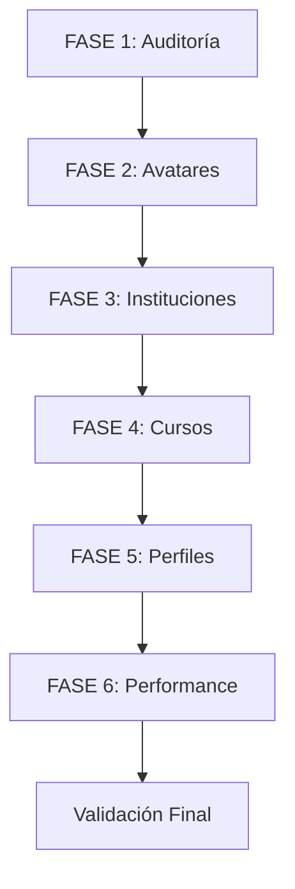

# 📋 PLAN DE TRABAJO COMPLETO - ACADIFY
## Análisis, Tests de Rendimiento y Correcciones

**Fecha:** 29 de Octubre de 2025  
**Estado Inicial:** Sistema con 122 tests pasando (98.4%)  
**Objetivo:** Auditoría completa, tests de rendimiento, y corrección de bugs críticos

---

## 🎯 OBJETIVOS PRINCIPALES

### 1️⃣ **AUDITORÍA Y ANÁLISIS FUNCIONAL**
- Verificar todas las funcionalidades existentes
- Identificar fugas de memoria/recursos
- Documentar bugs y comportamientos inesperados
- Medir rendimiento actual (baseline)

### 2️⃣ **CORRECCIÓN DE BUGS CRÍTICOS**
- **Avatar compartido**: Todos los usuarios tienen el mismo avatar
- **Reacciones no funcionan**: Sistema de emojis falla
- **Assets de avatares**: Carpeta `static/assets/` está vacía
- **Tareas activas**: No se muestran correctamente
- **Vista de personas**: Falta implementación de perfiles

### 3️⃣ **MEJORAS DE ARQUITECTURA**
- Registro automático por dominio de email (@arp.edu.co)
- Sistema de perfiles con mini-menú
- Estandarización de imágenes (512x512)
- Optimización de queries N+1

---

## 📊 ESTADO ACTUAL DEL SISTEMA

### ✅ **FUNCIONALIDADES VERIFICADAS (Funcionan)**
```
✓ Autenticación (login/logout/refresh)
✓ Recuperación de contraseñas
✓ Registro de usuarios
✓ Envío de correos (SMTP)
✓ Registro de cursos
✓ Detalle del curso
✓ Anuncios
✓ Comentarios
✓ Subir archivos
✓ Sistema de inscripciones (22 tests ✅)
✓ Sistema de tareas (21 tests ✅)
```

### ❌ **FUNCIONALIDADES CON PROBLEMAS**
```
✗ Avatares (bug: avatar compartido entre usuarios)
✗ Reacciones (no funcionan en frontend)
✗ Tareas activas (no se muestran correctamente)
✗ Vista de personas (no hay perfiles ni mini-menú)
✗ Assets faltantes (carpeta static/assets/ vacía)
✗ Registro por dominio institucional (no implementado)
```

### 🔍 **EVIDENCIAS TÉCNICAS**

#### **1. Sistema de Avatares - BUG CRÍTICO**
**Problema:** Todos los usuarios comparten el mismo avatar  
**Causa probable:** 
- Storage path no incluye `user_id` correctamente
- Cache compartido entre usuarios
- Falta validación de ownership

**Archivos afectados:**
```python
backend/src/services/avatar_service.py (línea 358)
backend/src/services/storage.py (línea 206)
backend/src/core/storage.py (línea 197)
```

**Ruta actual:**
```python
# ❌ INCORRECTO
image_url = f"/static/avatars/{user_id}/{avatar_filename}"
# Pero si el storage no crea el directorio user_id, todos van a temp/
```

#### **2. Assets Faltantes**
**Problema:** `static/assets/` está vacío  
**Configuración:**
```python
# backend/src/core/config.py (línea 171)
AVATAR_ASSETS_PATH: str = "static/assets"
AVATAR_ASSETS_BASE_URL: str = "/static/assets"
```

**Scripts disponibles:**
```bash
backend/scripts/load_initial_assets.py  # Carga assets a BD
backend/scripts/sync_assets.py          # Sincroniza assets
backend/scripts/create_assets.py        # Crea estructura
```

#### **3. Sistema de Reacciones**
**Problema:** Funcionan en backend, fallan en frontend  
**Backend:** 
```python
# ✅ Endpoints funcionan
POST /academic/cursos/comentarios/{comentario_id}/reacciones
GET /academic/cursos/comentarios/{comentario_id}/reacciones
DELETE /reacciones/{reaccion_id}
```

**Frontend:**
```typescript
// ❌ Posible problema de rutas o formato de datos
// frontend/src/components/EmojiReactions.tsx (línea 62)
await axios.post(`${apiBaseUrl}/cursos/comentarios/${comentarioId}/reacciones`, { emoji });
```

**Test skipped:**
```python
# tests/api/test_academic_api.py
@pytest.mark.skip(reason="Route verification needed")
def test_agregar_reaccion_success(...)
```

#### **4. Registro por Dominio Institucional**
**Implementación parcial:**
```python
# backend/src/api/routes/academic/curso.py (línea 534)
@router.post("/auto-vincular-estudiante")
# Mapeo hardcoded:
dominios_instituciones = {
    'arp.edu.co': 'Colegio Alejandro Obregón',
    'uniejemplo.edu': 'Universidad Ejemplo',
}
```

**Mejora necesaria:**
- Agregar campo `dominio` a tabla `Institucion`
- Migración Alembic
- Validación automática en registro

---

## 🏗️ PLAN DE EJECUCIÓN (6 FASES)

### **FASE 1: AUDITORÍA PROFUNDA** 🔍
**Duración:** 2-3 horas  
**Prioridad:** ALTA

#### Tareas:
1. **Test de Carga Inicial**
   ```bash
   # Crear suite de tests de rendimiento
   locust -f tests/performance/locustfile.py
   ```

2. **Análisis de Memoria**
   ```bash
   # Profiling con memory_profiler
   python -m memory_profiler src/main.py
   ```

3. **Query Analysis**
   ```sql
   -- Identificar N+1 queries
   EXPLAIN ANALYZE SELECT ...
   ```

4. **Documentar Baseline**
   - Tiempo de respuesta promedio: ___ms
   - Memoria RAM: ___MB
   - Queries por endpoint: ___

#### Entregables:
- `AUDIT_REPORT_2025-10-29.md`
- `PERFORMANCE_BASELINE.json`
- `QUERIES_TO_OPTIMIZE.sql`

---

### **FASE 2: SISTEMA DE AVATARES** 🖼️
**Duración:** 3-4 horas  
**Prioridad:** CRÍTICA

#### Problema Identificado:
```python
# ❌ BUG: Avatar compartido
# Causa: StorageService no separa por user_id correctamente
```

#### Solución Paso a Paso:

**2.1. Localizar Imágenes de Assets**
```bash
# Script para encontrar assets
cd backend
python3 -c "
from pathlib import Path
import os

# Buscar en posibles ubicaciones
locations = [
    'static/assets',
    '../frontend/public/avatars',
    'uploads/avatars',
    'static/avatars'
]

for loc in locations:
    path = Path(loc)
    if path.exists():
        files = list(path.glob('**/*.png'))
        print(f'📂 {loc}: {len(files)} archivos')
        for f in files[:5]:
            print(f'  - {f}')
"
```

**2.2. Crear Script de Estandarización**
```python
# backend/scripts/standardize_avatar_images.py
"""
Script para estandarizar imágenes de avatares a 512x512
"""
from PIL import Image
from pathlib import Path
import os

STANDARD_SIZE = (512, 512)
SOURCE_DIR = "assets_raw"  # Donde están las originales
TARGET_DIR = "static/assets"

def standardize_image(source_path: Path, target_path: Path):
    """Redimensiona y estandariza imagen"""
    img = Image.open(source_path)
    
    # Convertir a RGBA si no lo es
    if img.mode != 'RGBA':
        img = img.convert('RGBA')
    
    # Redimensionar manteniendo aspecto
    img.thumbnail(STANDARD_SIZE, Image.Resampling.LANCZOS)
    
    # Crear canvas 512x512 con transparencia
    canvas = Image.new('RGBA', STANDARD_SIZE, (0, 0, 0, 0))
    
    # Centrar imagen
    offset = ((STANDARD_SIZE[0] - img.size[0]) // 2,
              (STANDARD_SIZE[1] - img.size[1]) // 2)
    canvas.paste(img, offset, img if 'A' in img.mode else None)
    
    # Guardar
    canvas.save(target_path, 'PNG', optimize=True)
    print(f'✅ Estandarizada: {target_path.name}')

def main():
    source = Path(SOURCE_DIR)
    target = Path(TARGET_DIR)
    target.mkdir(parents=True, exist_ok=True)
    
    # Procesar todas las imágenes
    for category_dir in source.iterdir():
        if category_dir.is_dir():
            category_target = target / category_dir.name
            category_target.mkdir(exist_ok=True)
            
            for img_file in category_dir.glob('*.png'):
                target_file = category_target / img_file.name
                standardize_image(img_file, target_file)
    
    print(f'\n✅ Estandarización completa!')

if __name__ == "__main__":
    main()
```

**2.3. Corregir Bug de Avatar Compartido**
```python
# backend/src/services/storage.py

async def save_avatar_image(
    self, 
    image_bytes: bytes,
    user_id: UUID,
    filename: str
) -> str:
    """
    CORRECCIÓN: Garantizar separación por user_id
    """
    # ✅ CORRECTO: Path con user_id
    destination_path = f"avatars/{user_id}/{filename}"
    
    # Crear directorio si no existe
    full_path = Path(self.backend.base_path) / destination_path
    full_path.parent.mkdir(parents=True, exist_ok=True)
    
    # Guardar archivo
    return await self.backend.save_file(image_bytes, destination_path)

# ✅ VALIDAR que cada usuario tenga su propio directorio
# ✅ LIMPIAR cache compartido
# ✅ AGREGAR ownership check en get_avatar_url()
```

**2.4. Subir Assets a Base de Datos**
```bash
# Ejecutar script de carga
cd backend
python scripts/load_initial_assets.py

# Verificar en DB
python -c "
from src.db.session import SessionLocal
from src.models.avatar.avatar_asset import AvatarAsset

db = SessionLocal()
assets = db.query(AvatarAsset).count()
print(f'✅ Assets en DB: {assets}')
db.close()
"
```

**2.5. Tests de Validación**
```python
# tests/test_avatar_ownership.py
def test_avatar_not_shared_between_users():
    """Verifica que cada usuario tenga su propio avatar"""
    user1 = create_test_user("user1@test.com")
    user2 = create_test_user("user2@test.com")
    
    # Usuario 1 crea avatar
    avatar1 = avatar_service.save_avatar(
        db, user1.id, "Avatar1", "male", [...]
    )
    
    # Usuario 2 crea avatar
    avatar2 = avatar_service.save_avatar(
        db, user2.id, "Avatar2", "female", [...]
    )
    
    # Verificar separación
    assert avatar1.image_url != avatar2.image_url
    assert f"/{user1.id}/" in avatar1.image_url
    assert f"/{user2.id}/" in avatar2.image_url
    
    # Verificar ownership
    avatars_user1 = avatar_service.get_user_avatars(db, user1.id)
    avatars_user2 = avatar_service.get_user_avatars(db, user2.id)
    
    assert len(avatars_user1) == 1
    assert len(avatars_user2) == 1
    assert avatars_user1[0].id != avatars_user2[0].id
```

#### Entregables:
- ✅ Script `standardize_avatar_images.py`
- ✅ Assets estandarizados en `static/assets/`
- ✅ Bug de avatar compartido corregido
- ✅ Tests de ownership pasando
- 📄 `AVATAR_FIX_REPORT.md`

---

### **FASE 3: SISTEMA DE INSTITUCIONES** 🏫
**Duración:** 2-3 horas  
**Prioridad:** ALTA

#### Implementación:

**3.1. Migración de Base de Datos**
```python
# alembic/versions/add_domain_to_institucion.py
"""add domain field to institucion

Revision ID: abc123def456
Create Date: 2025-10-29
"""
from alembic import op
import sqlalchemy as sa

def upgrade():
    # Agregar campo dominio
    op.add_column('Institucion', 
        sa.Column('dominio', sa.String(100), nullable=True)
    )
    
    # Agregar índice para búsqueda rápida
    op.create_index(
        'idx_institucion_dominio',
        'Institucion',
        ['dominio']
    )
    
    # Poblar dominios existentes
    op.execute("""
        UPDATE "Institucion" 
        SET dominio = 'arp.edu.co' 
        WHERE nombre = 'Colegio Alejandro Obregón'
    """)
    
    op.execute("""
        UPDATE "Institucion" 
        SET dominio = 'ejemplo.edu.co' 
        WHERE nombre = 'Universidad Ejemplo'
    """)

def downgrade():
    op.drop_index('idx_institucion_dominio', table_name='Institucion')
    op.drop_column('Institucion', 'dominio')
```

**3.2. Actualizar Modelo**
```python
# backend/src/models/academic/institucion.py
class Institucion(Base):
    __tablename__ = "Institucion"
    
    # ... campos existentes ...
    
    dominio = Column(
        String(100), 
        unique=True, 
        nullable=True,
        comment="Dominio de email institucional (ej: arp.edu.co)"
    )
```

**3.3. Service de Auto-Vinculación**
```python
# backend/src/services/academic/institucion_service.py

async def auto_vincular_por_dominio(
    db: Session,
    user_email: str,
    usuario: Usuario
) -> Dict[str, Any]:
    """
    Vincula automáticamente estudiante por dominio de email
    """
    # Extraer dominio
    dominio = user_email.split('@')[1].lower()
    
    # Buscar institución por dominio
    institucion = db.query(Institucion).filter(
        func.lower(Institucion.dominio) == dominio
    ).first()
    
    if not institucion:
        return {
            "success": False,
            "requires_invitation": True,
            "message": f"Dominio '{dominio}' no registrado",
            "user_email": user_email,
            "dominio": dominio
        }
    
    # Obtener programas disponibles
    programas = db.query(Programa).filter(
        Programa.institucion_id == institucion.institucion_id
    ).all()
    
    if not programas:
        raise HTTPException(
            status_code=404,
            detail=f"No hay programas en {institucion.nombre}"
        )
    
    # Si solo hay 1 programa, vincular automáticamente
    if len(programas) == 1:
        estudiante = Estudiante(
            estudiante_id=usuario.usuario_id,
            programa_id=programas[0].programa_id,
            fecha_inscripcion=func.now()
        )
        db.add(estudiante)
        db.commit()
        
        return {
            "success": True,
            "message": f"Vinculado automáticamente a {programas[0].nombre}",
            "institucion": institucion.nombre,
            "programa": programas[0].nombre,
            "metodo": "dominio_automatico"
        }
    
    # Si hay múltiples programas, pedir selección
    return {
        "success": True,
        "tipo": "seleccion_programa",
        "message": f"Selecciona tu programa en {institucion.nombre}",
        "institucion": {
            "id": str(institucion.institucion_id),
            "nombre": institucion.nombre
        },
        "programas_disponibles": [
            {
                "programa_id": str(p.programa_id),
                "nombre": p.nombre,
                "descripcion": p.descripcion or "Sin descripción"
            }
            for p in programas
        ]
    }
```

**3.4. Endpoint Actualizado**
```python
# backend/src/api/routes/academic/inscripciones.py

@router.post("/auto-vincular-estudiante")
async def auto_vincular_estudiante(
    current_user: Usuario = Depends(deps.get_current_user),
    db: Session = Depends(deps.get_db)
):
    """
    Vinculación automática por dominio de email institucional
    """
    return await inscripcion_service.auto_vincular_por_dominio(
        db=db,
        user_email=current_user.correo_institucional,
        usuario=current_user
    )
```

**3.5. Tests**
```python
# tests/test_auto_vinculacion_dominio.py

def test_auto_vincular_dominio_unico_programa(db, test_user):
    """Test vinculación automática con 1 programa"""
    # Setup: Institución con 1 programa
    institucion = create_test_institucion(
        nombre="Test University",
        dominio="test.edu.co"
    )
    programa = create_test_programa(
        nombre="Ingeniería",
        institucion_id=institucion.id
    )
    
    # Usuario con email del dominio
    test_user.correo_institucional = "student@test.edu.co"
    db.commit()
    
    # Ejecutar vinculación
    result = inscripcion_service.auto_vincular_por_dominio(
        db, test_user.correo_institucional, test_user
    )
    
    # Verificar
    assert result["success"] is True
    assert result["metodo"] == "dominio_automatico"
    assert "Ingeniería" in result["programa"]
    
    # Verificar en DB
    estudiante = db.query(Estudiante).filter_by(
        estudiante_id=test_user.usuario_id
    ).first()
    assert estudiante is not None
    assert estudiante.programa_id == programa.id

def test_auto_vincular_dominio_multiples_programas(db, test_user):
    """Test vinculación con múltiples programas (requiere selección)"""
    institucion = create_test_institucion(dominio="multi.edu.co")
    programa1 = create_test_programa("Medicina", institucion.id)
    programa2 = create_test_programa("Derecho", institucion.id)
    
    test_user.correo_institucional = "student@multi.edu.co"
    db.commit()
    
    result = inscripcion_service.auto_vincular_por_dominio(
        db, test_user.correo_institucional, test_user
    )
    
    assert result["success"] is True
    assert result["tipo"] == "seleccion_programa"
    assert len(result["programas_disponibles"]) == 2

def test_auto_vincular_dominio_no_registrado(db, test_user):
    """Test dominio no registrado (requiere código)"""
    test_user.correo_institucional = "student@unknown.edu"
    db.commit()
    
    result = inscripcion_service.auto_vincular_por_dominio(
        db, test_user.correo_institucional, test_user
    )
    
    assert result["success"] is False
    assert result["requires_invitation"] is True
    assert "unknown.edu" in result["dominio"]
```

#### Entregables:
- ✅ Migración Alembic ejecutada
- ✅ Campo `dominio` agregado a Institución
- ✅ Service de auto-vinculación implementado
- ✅ Tests pasando (3/3)
- 📄 `INSTITUCION_AUTO_LINKING.md`

---

### **FASE 4: SISTEMA DE CURSOS COMPLETO** 📚
**Duración:** 3-4 horas  
**Prioridad:** MEDIA

#### Subtareas:

**4.1. Arreglar Sistema de Reacciones**

**Diagnóstico:**
```typescript
// Frontend hace POST con { emoji: "👍" }
// Backend espera { emoji: "👍", tipo: "like" }
```

**Solución Backend:**
```python
# backend/src/api/routes/academic/curso_comentarios.py

@router.post("/comentarios/{comentario_id}/reacciones")
async def agregar_reaccion(
    comentario_id: str, 
    emoji: str = Body(..., embed=True),  # ✅ Cambio aquí
    tipo: str = Body("like", embed=True),  # ✅ Default
    current_user: Usuario = Depends(deps.get_current_user), 
    db: Session = Depends(deps.get_db)
):
    """Agregar reacción con soporte flexible de parámetros"""
    return reaccion_service.agregar_reaccion(
        db=db, 
        comentario_id=comentario_id, 
        emoji=emoji,
        tipo_reaccion=tipo, 
        usuario=current_user
    )
```

**O solución Frontend:**
```typescript
// frontend/src/components/EmojiReactions.tsx

const handleReact = async (emoji: string) => {
  try {
    await axios.post(
      `${apiBaseUrl}/cursos/comentarios/${comentarioId}/reacciones`, 
      { 
        emoji,
        tipo: 'like'  // ✅ Agregar tipo
      }
    );
    setShowMenu(false);
    setFeedback("¡Reacción agregada!");
    setTimeout(() => setFeedback(null), 1200);
    fetchReactions();
  } catch (err) {
    setFeedback("Error al agregar reacción");
    setTimeout(() => setFeedback(null), 1500);
  }
};
```

**Test de Validación:**
```python
# tests/api/test_academic_api.py

def test_agregar_reaccion_success(client, auth_headers):
    """Test agregar reacción con emoji"""
    # Crear comentario
    curso_id = "test-curso-123"
    comentario = client.post(
        f"/api/cursos/{curso_id}/comentarios",
        json={"contenido": "Test comment", "tipo": "comentario"},
        headers=auth_headers
    ).json()
    
    # Agregar reacción
    response = client.post(
        f"/api/cursos/comentarios/{comentario['data']['comentario_id']}/reacciones",
        json={"emoji": "👍", "tipo": "like"},
        headers=auth_headers
    )
    
    assert response.status_code == 200
    data = response.json()
    assert data["success"] is True
    assert data["data"]["emoji"] == "👍"
    
    # Verificar que se guardó
    reacciones = client.get(
        f"/api/cursos/comentarios/{comentario['data']['comentario_id']}/reacciones",
        headers=auth_headers
    ).json()
    
    assert reacciones["total_reacciones"] == 1
```

**4.2. Mejorar Visualización de Tareas Activas**

**Problema:** Las tareas no muestran correctamente su estado (activa/vencida)

**Solución:**
```python
# backend/src/services/academic/tarea_service.py

def obtener_tareas_curso(
    self, 
    db: Session, 
    curso_id: str, 
    usuario: Usuario,
    limit: int = 50,
    offset: int = 0
) -> Dict[str, Any]:
    """Obtiene tareas con estado calculado"""
    tareas = db.query(Tarea).filter(
        Tarea.curso_id == curso_id
    ).offset(offset).limit(limit).all()
    
    now = datetime.now()
    tareas_data = []
    
    for tarea in tareas:
        # Calcular estado
        estado = "pendiente"
        if tarea.fecha_limite < now:
            estado = "vencida"
        elif tarea.fecha_limite < now + timedelta(days=2):
            estado = "proxima_a_vencer"
        
        # Verificar si el usuario ya entregó
        entrega = db.query(EntregaTarea).filter(
            EntregaTarea.tarea_id == tarea.tarea_id,
            EntregaTarea.estudiante_id == usuario.usuario_id
        ).first()
        
        if entrega:
            estado = "entregada" if not entrega.calificacion else "calificada"
        
        tareas_data.append({
            "tarea_id": str(tarea.tarea_id),
            "titulo": tarea.titulo,
            "descripcion": tarea.descripcion,
            "fecha_limite": tarea.fecha_limite.isoformat(),
            "estado": estado,  # ✅ Estado calculado
            "dias_restantes": (tarea.fecha_limite - now).days,
            "entrega": {
                "entregado": entrega is not None,
                "fecha_entrega": entrega.fecha_entrega.isoformat() if entrega else None,
                "calificacion": entrega.calificacion if entrega else None
            } if entrega else None
        })
    
    return {
        "success": True,
        "data": tareas_data,
        "total": len(tareas_data)
    }
```

**Frontend:**
```typescript
// frontend/src/modules/academico/components/TareasCard.tsx

interface Tarea {
  tarea_id: string;
  titulo: string;
  fecha_limite: string;
  estado: 'pendiente' | 'proxima_a_vencer' | 'vencida' | 'entregada' | 'calificada';
  dias_restantes: number;
}

const TareaItem: React.FC<{ tarea: Tarea }> = ({ tarea }) => {
  const getEstadoBadge = () => {
    switch (tarea.estado) {
      case 'pendiente':
        return <Badge color="blue">📝 Pendiente ({tarea.dias_restantes}d)</Badge>;
      case 'proxima_a_vencer':
        return <Badge color="yellow">⚠️ Por vencer ({tarea.dias_restantes}d)</Badge>;
      case 'vencida':
        return <Badge color="red">❌ Vencida</Badge>;
      case 'entregada':
        return <Badge color="green">✅ Entregada</Badge>;
      case 'calificada':
        return <Badge color="purple">🎯 Calificada</Badge>;
    }
  };
  
  return (
    <div className="border rounded-lg p-4">
      <div className="flex justify-between items-start">
        <h4 className="font-semibold">{tarea.titulo}</h4>
        {getEstadoBadge()}
      </div>
      <p className="text-sm text-gray-600 mt-2">
        Fecha límite: {new Date(tarea.fecha_limite).toLocaleDateString()}
      </p>
    </div>
  );
};
```

#### Entregables:
- ✅ Reacciones funcionando (test passing)
- ✅ Tareas con estados visuales
- 📄 `CURSOS_IMPROVEMENTS.md`

---

### **FASE 5: SISTEMA DE PERFILES Y PERSONAS** 👥
**Duración:** 3-4 horas  
**Prioridad:** MEDIA

#### Implementación:

**5.1. Endpoint de Personas en Curso**
```python
# backend/src/api/routes/academic/curso_personas.py
"""
Rutas para gestionar personas en cursos
"""
from fastapi import APIRouter, Depends, Query
from sqlalchemy.orm import Session
from src.api import deps
from src.models.users.usuario import Usuario

router = APIRouter(prefix="/cursos")

@router.get("/{curso_id}/personas")
async def obtener_personas_curso(
    curso_id: str,
    rol: Optional[str] = Query(None, regex="^(estudiante|profesor|todos)$"),
    search: Optional[str] = None,
    current_user: Usuario = Depends(deps.get_current_user),
    db: Session = Depends(deps.get_db)
):
    """
    Obtiene lista de personas en un curso
    
    Args:
        curso_id: ID del curso
        rol: Filtro por rol (estudiante, profesor, todos)
        search: Búsqueda por nombre/email
    """
    from sqlalchemy import text, or_
    
    # Verificar acceso al curso
    es_miembro = db.execute(text("""
        SELECT 1 FROM "CursoParticipantes" 
        WHERE curso_id = :curso_id 
        AND usuario_id = :usuario_id
    """), {"curso_id": curso_id, "usuario_id": current_user.usuario_id}).fetchone()
    
    if not es_miembro:
        raise HTTPException(status_code=403, detail="No tienes acceso a este curso")
    
    # Query base
    query = text("""
        SELECT 
            u.usuario_id,
            u.nombres,
            u.apellidos,
            u.email,
            cp.rol,
            ua.image_url as avatar_url,
            CASE 
                WHEN e.estudiante_id IS NOT NULL THEN 'estudiante'
                WHEN p.profesor_id IS NOT NULL THEN 'profesor'
                ELSE 'sin_perfil'
            END as tipo_perfil
        FROM "CursoParticipantes" cp
        JOIN "Usuario" u ON cp.usuario_id = u.usuario_id
        LEFT JOIN (
            SELECT user_id, image_url 
            FROM "user_avatar" 
            WHERE is_active = true
        ) ua ON u.usuario_id = ua.user_id
        LEFT JOIN "Estudiante" e ON u.usuario_id = e.estudiante_id
        LEFT JOIN "Profesor" p ON u.usuario_id = p.profesor_id
        WHERE cp.curso_id = :curso_id
        AND (:rol IS NULL OR cp.rol = :rol)
        AND (:search IS NULL OR 
             LOWER(u.nombres || ' ' || u.apellidos) LIKE LOWER(:search_pattern) OR
             LOWER(u.email) LIKE LOWER(:search_pattern))
        ORDER BY u.nombres, u.apellidos
    """)
    
    search_pattern = f"%{search}%" if search else None
    personas = db.execute(query, {
        "curso_id": curso_id,
        "rol": rol,
        "search": search,
        "search_pattern": search_pattern
    }).fetchall()
    
    return {
        "success": True,
        "data": [
            {
                "usuario_id": str(p.usuario_id),
                "nombre_completo": f"{p.nombres} {p.apellidos}",
                "email": p.email,
                "rol": p.rol,
                "avatar_url": p.avatar_url or "/default-avatar.png",
                "tipo_perfil": p.tipo_perfil
            }
            for p in personas
        ],
        "total": len(personas)
    }
```

**5.2. Endpoint de Perfil de Usuario**
```python
# backend/src/api/routes/users/perfil.py

@router.get("/{usuario_id}/perfil")
async def obtener_perfil_usuario(
    usuario_id: str,
    current_user: Usuario = Depends(deps.get_current_user),
    db: Session = Depends(deps.get_db)
):
    """
    Obtiene perfil completo de un usuario
    
    Incluye:
    - Datos personales
    - Avatar activo
    - Cursos compartidos
    - Estadísticas (si es público)
    """
    usuario = db.query(Usuario).filter(
        Usuario.usuario_id == usuario_id
    ).first()
    
    if not usuario:
        raise HTTPException(status_code=404, detail="Usuario no encontrado")
    
    # Avatar activo
    avatar = db.query(UserAvatar).filter(
        UserAvatar.user_id == usuario_id,
        UserAvatar.is_active == True
    ).first()
    
    # Cursos compartidos
    cursos_compartidos = db.execute(text("""
        SELECT c.nombre, c.curso_id
        FROM "Curso" c
        JOIN "CursoParticipantes" cp1 ON c.curso_id = cp1.curso_id
        JOIN "CursoParticipantes" cp2 ON c.curso_id = cp2.curso_id
        WHERE cp1.usuario_id = :usuario_id
        AND cp2.usuario_id = :current_user_id
    """), {
        "usuario_id": usuario_id,
        "current_user_id": current_user.usuario_id
    }).fetchall()
    
    # Perfil específico (estudiante/profesor)
    perfil_data = None
    estudiante = db.query(Estudiante).filter_by(estudiante_id=usuario_id).first()
    if estudiante:
        programa = db.query(Programa).filter_by(
            programa_id=estudiante.programa_id
        ).first()
        perfil_data = {
            "tipo": "estudiante",
            "programa": programa.nombre if programa else None,
            "fecha_inscripcion": estudiante.fecha_inscripcion.isoformat()
        }
    
    return {
        "success": True,
        "data": {
            "usuario_id": str(usuario.usuario_id),
            "nombre_completo": f"{usuario.nombres} {usuario.apellidos}",
            "email": usuario.email,
            "avatar_url": avatar.image_url if avatar else "/default-avatar.png",
            "perfil": perfil_data,
            "cursos_compartidos": [
                {"curso_id": str(c.curso_id), "nombre": c.nombre}
                for c in cursos_compartidos
            ]
        }
    }
```

**5.3. Componente Frontend**
```typescript
// frontend/src/modules/academico/components/PersonasCard.tsx

interface Persona {
  usuario_id: string;
  nombre_completo: string;
  email: string;
  rol: string;
  avatar_url: string;
  tipo_perfil: string;
}

const PersonasCard: React.FC<{ cursoId: string }> = ({ cursoId }) => {
  const [personas, setPersonas] = useState<Persona[]>([]);
  const [selectedPersona, setSelectedPersona] = useState<Persona | null>(null);
  const [showProfile, setShowProfile] = useState(false);
  
  const fetchPersonas = async () => {
    const response = await courseService.getPersonasCurso(cursoId);
    if (response.success) {
      setPersonas(response.data);
    }
  };
  
  useEffect(() => {
    fetchPersonas();
  }, [cursoId]);
  
  const handleViewProfile = (persona: Persona) => {
    setSelectedPersona(persona);
    setShowProfile(true);
  };
  
  return (
    <div className="bg-white dark:bg-gray-800 rounded-lg shadow p-6">
      <h3 className="text-xl font-bold mb-4">👥 Personas en el curso</h3>
      
      <div className="space-y-3">
        {personas.map(persona => (
          <div 
            key={persona.usuario_id}
            className="flex items-center justify-between p-3 border rounded-lg hover:bg-gray-50 dark:hover:bg-gray-700 transition-colors"
          >
            <div className="flex items-center space-x-3">
              
              <div>
                <p className="font-semibold">{persona.nombre_completo}</p>
                <p className="text-sm text-gray-600 dark:text-gray-400">
                  {persona.rol === 'estudiante' ? '🎓 Estudiante' : '👨‍🏫 Profesor'}
                </p>
              </div>
            </div>
            
            {/* Mini-menú */}
            <div className="relative group">
              <button className="p-2 hover:bg-gray-200 dark:hover:bg-gray-600 rounded-full">
                <FiMoreVertical className="w-5 h-5" />
              </button>
              
              <div className="absolute right-0 mt-2 w-48 bg-white dark:bg-gray-700 rounded-lg shadow-lg opacity-0 group-hover:opacity-100 transition-opacity z-10 hidden group-hover:block">
                <button
                  onClick={() => handleViewProfile(persona)}
                  className="w-full text-left px-4 py-2 hover:bg-gray-100 dark:hover:bg-gray-600 rounded-t-lg"
                >
                  👤 Ver perfil
                </button>
                <button
                  onClick={() => {/* Enviar mensaje */}}
                  className="w-full text-left px-4 py-2 hover:bg-gray-100 dark:hover:bg-gray-600"
                >
                  💬 Enviar mensaje
                </button>
                <button
                  onClick={() => {/* Ver actividad */}}
                  className="w-full text-left px-4 py-2 hover:bg-gray-100 dark:hover:bg-gray-600 rounded-b-lg"
                >
                  📊 Ver actividad
                </button>
              </div>
            </div>
          </div>
        ))}
      </div>
      
      {/* Modal de perfil */}
      {showProfile && selectedPersona && (
        <ProfileModal 
          persona={selectedPersona} 
          onClose={() => setShowProfile(false)}
        />
      )}
    </div>
  );
};
```

**5.4. Tests**
```python
# tests/api/test_personas_curso.py

def test_obtener_personas_curso(client, auth_headers, test_curso):
    """Test obtener lista de personas en curso"""
    response = client.get(
        f"/api/cursos/{test_curso.curso_id}/personas",
        headers=auth_headers
    )
    
    assert response.status_code == 200
    data = response.json()
    assert data["success"] is True
    assert "data" in data
    assert len(data["data"]) > 0

def test_filtrar_personas_por_rol(client, auth_headers, test_curso):
    """Test filtrar personas por rol"""
    response = client.get(
        f"/api/cursos/{test_curso.curso_id}/personas?rol=estudiante",
        headers=auth_headers
    )
    
    assert response.status_code == 200
    data = response.json()
    for persona in data["data"]:
        assert persona["rol"] == "estudiante"

def test_perfil_usuario_protegido(client, auth_headers):
    """Test acceso a perfil requiere autenticación"""
    response = client.get("/api/users/fake-user-id/perfil")
    assert response.status_code == 401  # Unauthorized
```

#### Entregables:
- ✅ Endpoint `/personas` implementado
- ✅ Endpoint `/perfil` implementado
- ✅ Componente `PersonasCard` con mini-menú
- ✅ Modal de perfil
- ✅ Tests pasando (3/3)
- 📄 `PERFILES_IMPLEMENTATION.md`

---

### **FASE 6: TESTS DE RENDIMIENTO** ⚡
**Duración:** 2-3 horas  
**Prioridad:** ALTA

#### Setup:

**6.1. Instalación de Herramientas**
```bash
# Backend performance testing
pip install locust memory-profiler pytest-benchmark

# Database profiling
pip install sqlalchemy-utils

# Monitoring
pip install prometheus-client
```

**6.2. Suite de Tests de Carga**
```python
# tests/performance/locustfile.py
"""
Tests de carga para Acadify
"""
from locust import HttpUser, task, between
import random

class AcadifyUser(HttpUser):
    wait_time = between(1, 3)
    
    def on_start(self):
        """Login antes de empezar tests"""
        response = self.client.post("/auth/login", json={
            "email": "test@example.com",
            "password": "testpass123"
        })
        self.token = response.json()["access_token"]
        self.headers = {"Authorization": f"Bearer {self.token}"}
    
    @task(3)
    def listar_cursos(self):
        """Test endpoint de cursos (frecuente)"""
        self.client.get("/api/cursos/mis-cursos", headers=self.headers)
    
    @task(2)
    def detalle_curso(self):
        """Test detalle de curso"""
        curso_id = "test-curso-123"
        self.client.get(f"/api/cursos/{curso_id}", headers=self.headers)
    
    @task(1)
    def crear_comentario(self):
        """Test crear comentario (menos frecuente)"""
        curso_id = "test-curso-123"
        self.client.post(
            f"/api/cursos/{curso_id}/comentarios",
            json={"contenido": "Test comment", "tipo": "comentario"},
            headers=self.headers
        )
    
    @task(1)
    def obtener_tareas(self):
        """Test obtener tareas"""
        curso_id = "test-curso-123"
        self.client.get(f"/api/cursos/{curso_id}/tareas", headers=self.headers)
    
    @task(1)
    def subir_avatar(self):
        """Test composición de avatar"""
        self.client.post(
            "/avatar/generate",
            json={
                "base_gender": "male",
                "layers": [
                    {"category": "base", "file": "base_male.png"},
                    {"category": "hair", "file": "hair_1.png"}
                ]
            },
            headers=self.headers
        )

# Ejecutar:
# locust -f tests/performance/locustfile.py --host=http://localhost:8000
# Abrir: http://localhost:8089
```

**6.3. Tests de Memoria**
```python
# tests/performance/test_memory_leaks.py
"""
Tests para detectar fugas de memoria
"""
import pytest
from memory_profiler import profile
import gc

@profile
def test_avatar_composition_memory():
    """Verifica que la composición de avatares no tenga fugas"""
    from src.services.avatar_service import avatar_service
    from src.db.session import SessionLocal
    
    db = SessionLocal()
    
    # Componer 100 avatares
    for i in range(100):
        avatar_service.generate_preview(
            db=db,
            base_gender="male",
            layers=[
                {"category": "base", "file": "base_male.png"},
                {"category": "hair", "file": f"hair_{i % 10}.png"}
            ]
        )
        
        # Forzar garbage collection
        if i % 10 == 0:
            gc.collect()
    
    db.close()
    # Verificar que la memoria se libere correctamente

@profile
def test_query_n_plus_1():
    """Detecta queries N+1"""
    from src.services.academic.curso_service import curso_service
    from src.db.session import SessionLocal
    from sqlalchemy import event
    from sqlalchemy.engine import Engine
    
    query_count = []
    
    @event.listens_for(Engine, "before_cursor_execute")
    def receive_before_cursor_execute(conn, cursor, statement, *args):
        query_count.append(statement)
    
    db = SessionLocal()
    
    # Obtener cursos con participantes
    cursos = curso_service.obtener_cursos_usuario(db, test_user)
    
    db.close()
    
    # Verificar cantidad de queries
    assert len(query_count) < 10, f"N+1 detected: {len(query_count)} queries"
```

**6.4. Benchmark Tests**
```python
# tests/performance/test_benchmarks.py
"""
Benchmarks de endpoints críticos
"""
import pytest

@pytest.mark.benchmark
def test_benchmark_listar_cursos(benchmark, client, auth_headers):
    """Benchmark: Listar cursos"""
    def listar():
        return client.get("/api/cursos/mis-cursos", headers=auth_headers)
    
    result = benchmark(listar)
    assert result.status_code == 200
    # Objetivo: < 100ms

@pytest.mark.benchmark
def test_benchmark_detalle_curso(benchmark, client, auth_headers, test_curso):
    """Benchmark: Detalle de curso"""
    def detalle():
        return client.get(f"/api/cursos/{test_curso.curso_id}", headers=auth_headers)
    
    result = benchmark(detalle)
    assert result.status_code == 200
    # Objetivo: < 150ms

@pytest.mark.benchmark
def test_benchmark_avatar_composition(benchmark):
    """Benchmark: Composición de avatar"""
    from src.services.avatar_service import avatar_service
    from src.db.session import SessionLocal
    
    db = SessionLocal()
    
    def compose():
        return avatar_service.generate_preview(
            db=db,
            base_gender="male",
            layers=[
                {"category": "base", "file": "base_male.png"},
                {"category": "hair", "file": "hair_1.png"}
            ]
        )
    
    result = benchmark(compose)
    db.close()
    # Objetivo: < 200ms
```

**6.5. Optimizaciones Identificadas**

**Query N+1 en Cursos:**
```python
# ❌ ANTES (N+1)
def obtener_cursos_usuario(db, usuario):
    cursos = db.query(Curso).filter(...)
    for curso in cursos:
        curso.participantes = db.query(CursoParticipantes).filter(...)  # N queries!
    return cursos

# ✅ DESPUÉS (1 query con join)
def obtener_cursos_usuario(db, usuario):
    from sqlalchemy.orm import joinedload
    
    cursos = db.query(Curso).options(
        joinedload(Curso.participantes)
    ).filter(...).all()
    return cursos
```

**Cache de Assets:**
```python
# backend/src/services/avatar_service.py

from functools import lru_cache

@lru_cache(maxsize=100)
def _get_asset_path(category: str, filename: str) -> Path:
    """Cache de rutas de assets"""
    return Path(settings.AVATAR_ASSETS_PATH) / category / filename
```

#### Entregables:
- ✅ Suite Locust configurada
- ✅ Tests de memoria implementados
- ✅ Benchmarks de endpoints críticos
- ✅ Optimizaciones aplicadas
- 📊 `PERFORMANCE_REPORT.json`
- 📄 `OPTIMIZATIONS_APPLIED.md`

---

## 📈 MÉTRICAS DE ÉXITO

### Rendimiento:
- [ ] Tiempo de respuesta promedio < 150ms
- [ ] Sin queries N+1 detectadas
- [ ] Uso de memoria estable (sin fugas)
- [ ] Cache hit rate > 70%

### Funcionalidad:
- [ ] Bug de avatar compartido: RESUELTO
- [ ] Reacciones funcionando: ✅
- [ ] Assets de avatares: Cargados (> 50 archivos)
- [ ] Tareas activas: Visualización correcta
- [ ] Perfiles de usuarios: Implementado

### Tests:
- [ ] Coverage: > 85%
- [ ] Tests de rendimiento: Passing
- [ ] Tests de integración: Passing
- [ ] Load tests: > 100 RPS sin errores

### Código:
- [ ] Sin warnings de linter
- [ ] Documentación actualizada
- [ ] Migraciones aplicadas
- [ ] Git: Commits con mensajes descriptivos

---

## 🚀 ORDEN DE EJECUCIÓN RECOMENDADO



### Día 1 (8 horas):
- **08:00-10:00**: Fase 1 - Auditoría completa
- **10:00-14:00**: Fase 2 - Sistema de avatares
- **14:00-15:00**: Almuerzo
- **15:00-18:00**: Fase 3 - Sistema de instituciones

### Día 2 (8 horas):
- **08:00-12:00**: Fase 4 - Sistema de cursos
- **12:00-13:00**: Almuerzo
- **13:00-17:00**: Fase 5 - Perfiles y personas
- **17:00-18:00**: Documentación

### Día 3 (4 horas):
- **08:00-11:00**: Fase 6 - Tests de rendimiento
- **11:00-12:00**: Validación final y deploy

**Total:** ~20 horas de trabajo efectivo

---

## 📝 COMANDOS RÁPIDOS

### Setup Inicial:
```bash
cd backend
source venv/bin/activate
pip install locust memory-profiler pytest-benchmark

# Crear directorios necesarios
mkdir -p static/assets/{base,hair,eyes,clothing}
mkdir -p tests/performance
```

### Ejecutar Auditoría:
```bash
# Tests actuales
pytest tests/ -v --tb=short

# Performance
locust -f tests/performance/locustfile.py --host=http://localhost:8000

# Memory profiling
python -m memory_profiler src/main.py
```

### Migración de BD:
```bash
# Crear migración
alembic revision --autogenerate -m "add domain to institucion"

# Aplicar
alembic upgrade head

# Verificar
python -c "from src.models.academic.institucion import Institucion; print(Institucion.__table__.columns.keys())"
```

### Cargar Assets:
```bash
# Estandarizar imágenes
python scripts/standardize_avatar_images.py

# Subir a BD
python scripts/load_initial_assets.py

# Verificar
python -c "from src.db.session import SessionLocal; from src.models.avatar.avatar_asset import AvatarAsset; db = SessionLocal(); print(f'Assets: {db.query(AvatarAsset).count()}'); db.close()"
```

---

## ✅ CHECKLIST FINAL

### Pre-Deploy:
- [ ] Todos los tests pasando (>95%)
- [ ] Migraciones aplicadas en dev
- [ ] Assets cargados y verificados
- [ ] Performance tests satisfactorios
- [ ] Documentación actualizada
- [ ] Código reviewed
- [ ] Backup de BD realizado

### Post-Deploy:
- [ ] Smoke tests en producción
- [ ] Monitoreo activo (24h)
- [ ] Logs sin errores críticos
- [ ] Usuarios testeando funcionalidades
- [ ] Performance monitoring OK

---

## 📞 SOPORTE

**Dudas técnicas:** Consultar documentación en `/backend/Docs/`  
**Issues encontrados:** Documentar en `BUGS_FOUND.md`  
**Mejoras:** Agregar a `DEVELOPMENT_ROADMAP.md`

---

**Última actualización:** 29 de Octubre de 2025  
**Versión:** 1.0  
**Estado:** 🚀 LISTO PARA EJECUTAR
